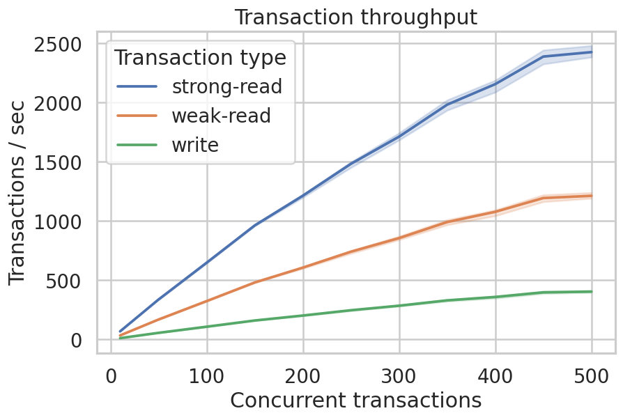
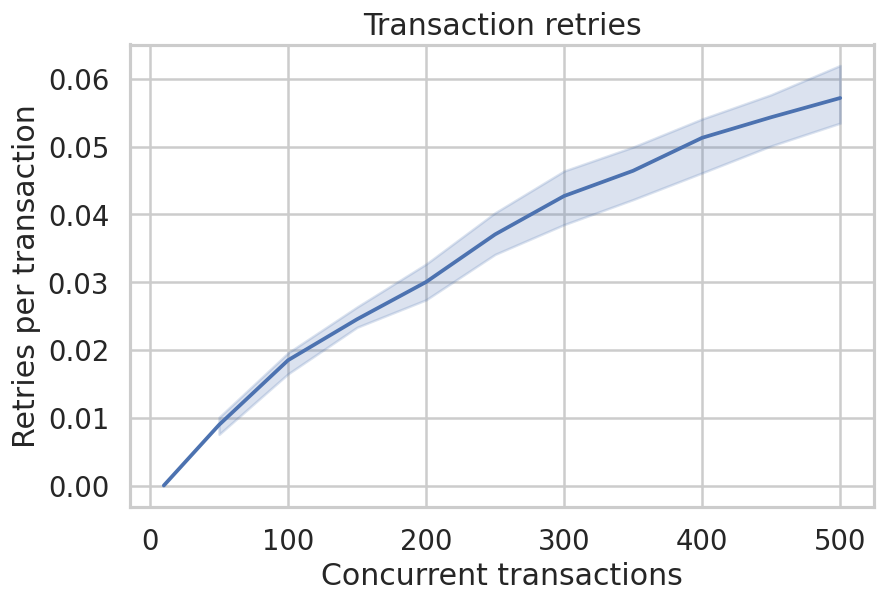
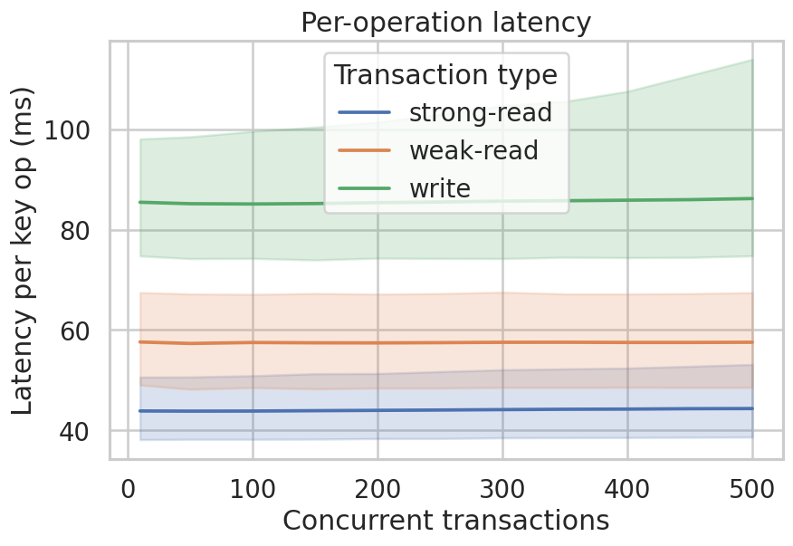
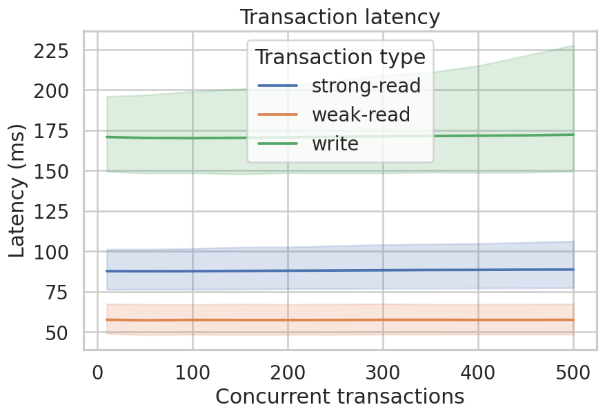

# GlassDB (Rust)

[](https://crates.io/crates/glassdb)
[](https://docs.rs/glassdb)
[](https://github.com/mbrt/glassdb-rs/actions?query=branch%3Amain)

Glass DB is a pure Rust key/value store on top of object storage (Amazon S3 or
Google Cloud Storage) that is _stateless_ and supports _ACID transactions_.
Clients import Glass DB as a library and don't need to deploy, nor depend on any
additional services. Everything is built on top of object storage.

This is the async (`tokio`-based) Rust implementation, ported from the original
[Go project](https://github.com/mbrt/glassdb). The commit protocol and on-disk
format is compatible with the original project.

The interface is inspired by [BoltDB](https://github.com/boltdb/bolt) and
Apple's [FoundationDB](https://github.com/apple/foundationdb).

## Status

> [!WARNING]
> This is still alpha software.

- Runtime: async, built on `tokio`.
- Backends: in-memory (`glassdb::backend::memory`), Amazon S3
  (`glassdb-backend-s3`, behind the `s3` feature), and Google Cloud Storage
  (`glassdb-backend-gcs`, behind the `gcs` feature).

Transactions _should_ be working correctly and performance could definitely
improve. Interfaces and file formats are _not_ stable and can still change at
any point.

For a deep dive into the internals, see the [architecture
doc](docs/architecture.md) and the companion [blog
post](https://blog.mbrt.dev/posts/transactional-object-storage) (created for the
Go version, but still relevant).

We support both [Google GCS](https://cloud.google.com/storage/) and [Amazon
S3](https://aws.amazon.com/s3/). Adding [Azure Blob
Storage](https://azure.microsoft.com/en-us/products/storage/blobs/) should be
very easy.

## Quick start

```rust
use glassdb::Database;
use glassdb::backend::memory::MemoryBackend;

#[tokio::main]
async fn main() -> Result<(), glassdb::Error> {
    let db = Database::open("example", MemoryBackend::new()).await?;

    let users = db.create_collection_if_absent("users").await?;

    // Single-key helpers run in their own transaction.
    users.write(b"alice", b"hello").await?;
    let v = users.read(b"alice").await?.expect("alice exists");
    assert_eq!(v, b"hello");

    // Multi-key serializable transaction with automatic conflict retries.
    // `tx` is an owned handle.
    let users = &users;
    db.tx(|tx| async move {
        let cur = tx
            .read(users, b"counter")
            .await?
            .unwrap_or_else(|| b"0".to_vec());
        let next = String::from_utf8_lossy(&cur).parse::<i64>().unwrap_or(0) + 1;
        tx.write(users, b"counter", next.to_string().as_bytes())
    })
    .await?;

    db.shutdown().await;
    Ok(())
}
```

To bound how long a transaction may run, wrap it in `tokio::time::timeout`:
dropping the future is the cancellation mechanism (the commit protocol
recovers any in-flight state).

## Cloud backends

The S3 and GCS backends are gated behind cargo features so their heavy
dependencies are only pulled in when needed:

```toml
glassdb = { version = "0.1", features = ["s3", "gcs"] }
```

Both implement the same `Backend` trait and can be dropped into `Database::open`:

```rust,ignore
// Amazon S3 (feature = "s3"): construct an aws-sdk-s3 client, then:
let backend = glassdb::s3::S3Backend::new(s3_client, "my-bucket");

// Google Cloud Storage (feature = "gcs"): uses Application Default Credentials.
let backend = glassdb::gcs::GcsBackend::new("my-bucket");
```

Each cloud crate is tested against a pure-Rust in-process fake of its API (no
Docker or live credentials required), mirroring the original `gofakes3` /
fake-GCS test setup.

## Why

This project makes the following specific tradeoffs:

- Optimizes for rare conflicts between transactions (optimistic locking).
- Readers are rarely blocked.
- Clients are completely stateless and ephemeral. For example, they can be
  scaled down to zero. We avoid explicit coordination between clients (e.g.
  there's no need for consensus messages).
- Requires access to object storage (the lowest latency the better) with
  requests preconditions (both Google GCS and AWS S3 meet the requirements).
- Assumes that, when transactions race each other, it's better to be slow than
  to be incorrect.
- High throughput is better than low latency.
- Allows stale reads if explicitly requested, but defaults to strong consistency
  in all cases.
- Values are in the range 1KB to 1MB.

Glass DB makes sense in contexts where there are many writers that rarely write
to the same keys or reads are more frequent than writes.

Why rewrite in Rust? Because having proper [DST
tests](#deterministic-simulated-time-in-tests) was proven impossible, and I
found that to be a deal-breaker for a stable database project. With LLM-powered
translation (and lots of review time), I found the porting appealing.

### Example 1: User settings

One example could be storing user settings. Every key is
dedicated to one user and the value contains all the settings. This way we can
update each user independently (and scale horizontally). In the rare case where
two updates for the same user arrive concurrently, we _don't_ produce an
inconsistent result but retry the transaction.

### Example 2: Low frequency updates

The application serves low traffic (e.g. one query per minute). What are the
choices today?

- Single machine / VM mostly idle.
- "Serverless" function with a managed database (for example Google Cloud Run +
  Cloud SQL, or fly.io).

Neither seem cost effective in the scenario. We are talking about $10 a month,
which is not huge, but can we do better?

Yes. With Glass DB you only pay for each query and long term storage. In the
case of GCS (as of 2023) we are talking about:

- $0.020 per GB per month
- $0.05 per 10k write / list ops
- $0.004 per 10k read ops

At a rate of one write per minute this would be around $2 a month. Less usage?
Even less money.

### Example 3: Analytics

Data ingestion can usually be done in parallel and designed in such a way that
different processes write independently.

A compaction process can run in parallel to the ingestion, bringing the data in
a shape better suited for the query layer.

Compaction and ingestion are mostly independent, but we must make sure to be
robust to crashes and restarts (avoiding e.g. double-counting or event
duplicates). This can be ensured with transactions provided by Glass DB. If most
transactions don't conflict with each other, the throughput will scale mostly
linearly (See [Performance](#performance)).

## Performance

We are obviously bound by object storage's latencies which are typically:

| Operation | Size    | Mean (ms) | Std Dev (ms) | Median (ms) | 90th % (ms) |
| --------- | ------- | --------- | ------------ | ----------- | ----------- |
| Download  | 1 KiB   | 57.4      | 6.6          | 56.8        | 64.8        |
| Download  | 100 KiB | 55.4      | 6.7          | 53.3        | 63.1        |
| Download  | 1 MiB   | 56.7      | 3.8          | 57.7        | 59.9        |
| Metadata  | 1 KiB   | 31.5      | 8.0          | 28.1        | 41.3        |
| Upload    | 1 KiB   | 70.4      | 17.3         | 64.7        | 88.8        |
| Upload    | 100 KiB | 88.9      | 14.6         | 83.1        | 105.0       |
| Upload    | 1 MiB   | 117.5     | 12.6         | 115.9       | 131.0       |

This is a lot slower than most databases, but still has a few advantages:

1. Throughput: we can leverage object storage scalability by reading and writing
   many objects in parallel. In this way we can perform many transactions per
   second (scale linearly). We would only be limited by bandwidth (see [GCS
   quotas](https://cloud.google.com/storage/quotas#bandwidth)).

1. Size scalability: object storage scales to petabytes and probably more, as
   cloud providers keep working on making them faster and more scalable.

See how this translates in a dataset of 50k keys, where we vary the number of
concurrent clients. Each client DB is performing 10 transactions in parallel,
split in this way:

- 10% updates (i.e. read + write) two separate random keys.
- 60% strong reads to two separate random keys.
- 30% weak reads to one random key (max staleness of 10s).

For example, with 5 concurrent DBs we would have 50 parallel transactions at
every moment.

We did all the tests below by using Google Cloud Storage as a backend.

### Throughput

Glass DB's throughput scales mostly linearly with the number of concurrent
clients and transactions:



The graph shows separately the three different types of transactions, where the
bold line is the median number of transactions per second and the error band
includes the 10th and 90th percentiles.

As you can see the median throughput increases linearly (better for reads than
for writes), touching 2.5k transactions per second with 500 concurrent clients.

To note also the slight performance degradation at the 10th percentile with more
than 30 concurrent DBs. This is due to the increased probability of conflicts
between transactions (e.g. when writers race each other).

See the transaction retries below, hurting performance at the higher
percentiles:



Since each transaction operates on multiple keys, here is for completeness the
graph of those. Each operation is a key being read or written:



It's interesting to see that weak reads are losing against strong reads in this
benchmark, for several reasons:

- Given the uniform distribution of reads, it's unlikely that a weak read will
  hit the same key twice within the 10 seconds allowed staleness time frame.
- Weak reads are currently translated into strong reads when the value is not
  present in cache.
- Strong reads operate on two keys in the same transactions, weak reads are a
  "single shot".

Taken all together this means that weak reads in this case translate mostly into
strong reads on a single key. These tend to perform worse (in terms of
throughput) than reading two keys per transactions, because they can be done in
parallel. The advantage of weak reads in this case comes with less sensitivity
to retries, as you can see from the lower variability at higher percentiles.

### Latency

Latency is not Glass DB's forte, but you can see below that it stays mostly flat
as we increase the number of concurrent clients and transactions:



Here the effects of the retries is more noticeable at higher percentiles, as
expected. Some transactions will start taking longer, as they have to drop their
work and restart after a conflict.

## Development

```bash
cargo build --workspace
make test     # fmt --check + clippy -D warnings + cargo test
make test-sim # tests under the deterministic simulation executor (+ fuzz-corpus replay)
make fuzz     # fuzz testing under DST. See Makefile for longer sweeps
```

Updating `glassdb-proto` protos require the Protocol Buffers compiler
(`protoc`).

### Deterministic simulated time in tests

GlassDB uses deterministic time combined with coverage-guided fuzz testing,
inspired by FoundationDB, for stress test the implementation while producing
reproducible failures. See [testing-dst](docs/guides/testing-dst.md) for more
details.

## Design notes

See [architecture.md](docs/architecture.md) for the design decisions behind the
implementation (concurrency model, time/determinism, error handling, and
encoding fidelity), and [porting-go.md](docs/archive/porting-go.md) for the (historical)
Go porting related tradeoffs.
