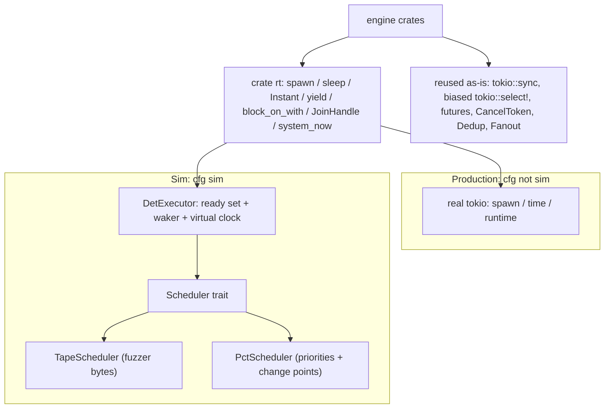

# ADR-011: Guided-interleaving DST on a minimal in-repo executor

## Status

Accepted

Follow-up to [ADR-010](010-fuzzer-coverage-guidance.md) and the runtime side of
[ADR-008](008-deterministic-simulation-fuzzer.md).

## Context

[ADR-008](008-deterministic-simulation-fuzzer.md) made the concurrency DST
deterministic by running the engine on [`madsim`](https://github.com/madsim-rs/madsim),
a deterministic `tokio` replacement, with a simulated network topology (one DB
per node, an RPC `NetBackend`, a network/node nemesis). [ADR-010](010-fuzzer-coverage-guidance.md)
then showed that coverage-guidance has little gradient over *schedules*: the bugs
the DST hunts live in the *order* of shared-state accesses, which neither
edge-coverage nor a `seed → PRNG → schedule` mapping lets the fuzzer steer. It
left two candidate directions for a genuinely *guided* interleaving search —
**schedule-tape** and **PCT** — to this ADR.

Two further pressures pointed the same way:

- **Dependency risk.** `madsim` is a large, deep dependency (it re-implements the
  `tokio` runtime, timer, and a network stack) whose primary maintainer has moved
  on. A core testing substrate that is hard to fork if abandoned is a liability.
- **Guidability needs control of poll order.** Neither `madsim` nor `turmoil`
  exposes "consume *these* bytes to choose the next task"; both seed their own
  schedulers. Bending them to a fuzzer-driven tape partly defeats the point of
  using a blessed substrate as-is.

The requirements for the replacement: impose **nothing** on library users, keep
**`tokio` in production**, add **minimal dependencies and minimal in-repo code**,
and make interleavings either **fuzzer-guidable** (schedule-tape) or **smartly
sampled** (PCT).

### What the engine actually needs from the runtime

Surveying the engine's async surface showed the redirected area is small:

- **`tokio::sync` is runtime-agnostic.** `Notify`, `Semaphore`, `mpsc`,
  `oneshot` work on any executor; only `*_timeout` needs the timer. So
  `CancelToken` (over `Notify`), `Dedup` (over `Semaphore`), the channel and
  fanout helpers, and `biased` `tokio::select!` are **reused unchanged** — exactly
  the surface `madsim`/`turmoil` spend most of their code re-implementing.
- Only **`tokio::spawn` and `tokio::time`** actually need the runtime, so they are
  the only seams to redirect.

A custom executor that controls *poll order at await points* is the one thing
that makes interleavings guidable or smartly sampled. It needs **zero new
dependencies**, and `shuttle` was rejected earlier as a poor fit (it models each
task as a thread with weak time modeling, wrong for this lease/staleness/backoff
engine).

## Decision

Replace the `madsim` runtime for the engine DST with a small, in-repo,
single-threaded **deterministic executor** that controls task poll order through
a pluggable scheduler, and route only `spawn`/`time` through a thin `rt` seam.
Faults move from the simulated network to a `Backend` middleware. The libFuzzer
target drives a **schedule-tape** scheduler; a **PCT** scheduler provides the
seed-breadth complement.

This **supersedes the `madsim` runtime/topology of ADR-008** for the engine DST.
It also **obsoletes the in-flight `turmoil` + `mad-turmoil` migration** for the
engine; `turmoil` is reserved only for a hypothetical future "real SDK client
over a *simulated network*" DST, and that prior migration plan is parked.

### Components

- **`rt` seam** ([`crates/glassdb-concurr/src/rt.rs`](../../crates/glassdb-concurr/src/rt.rs)).
  `spawn → JoinHandle`, `sleep`, `Instant`, `yield_now`, `system_now`. Under
  `#[cfg(not(sim))]` these re-export real `tokio` with zero overhead. Under
  `#[cfg(sim)]` they route to the executor when one is running on the thread, and
  fall back to real `tokio` otherwise, so ordinary `#[tokio::test]` unit tests
  still work in a `sim` build. `tokio::sync`, `tokio::select!`, and the channel /
  fanout / cancel / dedup helpers stay direct.
- **`DetExecutor`** ([`exec.rs`](../../crates/glassdb-concurr/src/exec.rs), sim
  only). Single-threaded; a `BTreeMap` task slab plus a sorted ready set keyed by
  `TaskId`. A standard `Waker` marks a task ready (routing `tokio::sync` wakeups
  back in). The run loop polls the scheduler-chosen ready task, advances a
  **virtual clock** only when no task is runnable (a `sleep` registers a timer in
  a heap; `Instant::now` reads `now`), and panics deterministically on deadlock
  (tasks exist, none runnable, no timer pending).
- **`Scheduler` trait** — `pick(&mut self, ready: &[TaskId]) -> usize` plus an
  `on_spawn` hook.
  - `TapeScheduler { tape, pos }`: `tape[pos++] % ready.len()`, with a fixed
    fallback when the tape is exhausted. The tape is part of the libFuzzer input,
    so byte mutations map *locally* to single scheduling perturbations — the
    gradient over orderings that ADR-010 found missing.
  - `PctScheduler { priorities, change_points, … }`: distinct random task
    priorities, always run the highest-priority runnable task, and demote the
    running task at `depth - 1` random change points — a provable lower bound on
    catching depth-`d` bugs, pairing with the seed-breadth model.
- **Seeded entropy.** One `SplitMix64` per run feeds `fill_random` (`TxId`
  prefixes); the `#[cfg(madsim)]` shim in [`txid.rs`](../../crates/glassdb-data/src/txid.rs)
  became a `#[cfg(sim)]` one. HashMap-order nondeterminism stays neutralized by
  the existing path-sorting (ADR-008).
- **Deterministic wall clock.** `rt::system_now()` returns a fixed epoch plus
  virtual time under the executor, so persisted transaction-log timestamps are a
  pure function of the seed; `Clock::anchored_at` reads `rt::Instant` so the
  monitor's clock follows the same virtual time.
- **Per-client transport fault injection** (replaces the madsim network nemesis).
  Faults belong to the *link* between one client and the store, not to the store
  itself, so each client gets its own
  [`FaultBackend`](../../crates/glassdb-backend/src/middleware/fault.rs) over a
  shared `MemoryBackend`+`RecordingBackend` backbone. Every op can fault on
  **either side** — a dropped request (never lands) or a lost ack (lands, outcome
  unknown / in-doubt) — plus a **sustained, all-or-nothing outage** per client
  ([`down`](../../crates/glassdb-backend/src/middleware/fault.rs)/`heal`):
  one decision makes a whole correlated outage deterministically reachable rather
  than needing coincident i.i.d. rolls. All preserve `acked <= final <= started`.
  A client "crash" is a `Ctx` cancel at an await point, after which the client
  **restarts on the same backend** to finish its remaining ops. Because outages
  are per-client, a downed client's peers keep reaching storage and recover its
  orphaned locks via lease expiry — exactly the lease-expiry / lock-lease-recovery
  paths the per-op rolls reached only by luck. The shared
  [`RecordingBackend`](../../crates/glassdb-backend/src/middleware/recording.rs)
  op-stream self-check is unchanged.
- **Tape-guided fault schedule.** Fault decisions are drawn from a
  [`Tape`](../../crates/glassdb-concurr/src/tape.rs) — a byte cursor that consumes
  fuzzer bytes and falls back to a seeded PRNG once they run out — so the *fault*
  schedule (which ops are delayed/dropped/lost, when clients crash, when/which
  client outages open) is coverage-guidable the same way interleavings are,
  instead of merely seed-sampled (the residual ADR-010 gap). The fuzzer supplies a
  dedicated fault tape, deinterleaved into disjoint streams for the crash nemesis,
  the outage nemesis, and each client transport; an empty tape reduces to pure
  seed-breadth sampling (PCT runs).
- **Harness** ([`sim.rs`](../../crates/glassdb/src/sim.rs)). Clients run as
  executor-spawned tasks over a shared in-process `MemoryBackend` wrapped in
  `FaultBackend`/`RecordingBackend`; the acked-bounds invariant (ADR-008) is kept.
  The public entry points are plain `async fn`s; the deterministic driver
  (`block_on_with(scheduler, seed, …)`) is supplied by the caller. A PCT
  seed-breadth run mode (`pct_assert` / `pct_record` / `pct_sweep`) lives behind
  `#[cfg(sim)]`.
- **Fuzz target** ([`fuzz/fuzz_targets/concurrent_tx.rs`](../../fuzz/fuzz_targets/concurrent_tx.rs)).
  Input bytes → `(rng_seed, Workload, FaultConfig, schedule_tape, fault_tape)`
  (the trailing bytes are halved into the two tapes); runs on the executor under a
  `TapeScheduler`. No `madsim`; crash-file reproduction unchanged.

### Build / cleanup

- The `madsim-tokio` alias and every `[target.'cfg(madsim)'.dependencies] madsim`
  block are dropped; crates depend on plain `tokio`. The workspace `check-cfg`
  lint and `Makefile` (`sim-test`/`fuzz`) move from `--cfg madsim` to `--cfg sim`.
  `net.rs` (the RPC transport) is deleted.

## Consequences

- **No heavy simulation dependency.** The deterministic substrate is ~600 lines
  of in-repo executor/scheduler/timer code, trivially forkable and auditable —
  the deliberate trade for zero external runtime deps. `tokio` is unchanged in
  production and the swap is entirely behind `--cfg sim`, so library users are
  unaffected.
- **Interleavings and faults are now guidable and smartly sampled.** The
  schedule-tape gives libFuzzer a local gradient over orderings, and the fault
  tape extends that gradient to the fault schedule (both ADR-010 gaps); PCT adds a
  principled seed-breadth sweep. Both replay byte-for-byte from their input.
- **Faults are simpler and more portable.** Fault injection is a `Backend`
  middleware that also runs under plain `tokio` tests, instead of a madsim-only
  network topology; the in-doubt/acked-bounds reasoning of ADR-008/ADR-009 carries
  over verbatim.
- **The engine suite is the correctness oracle.** Running the existing tests under
  `--cfg sim`, plus the byte-identical op-stream self-check (tape and PCT), gates
  executor faithfulness (spawn-from-task, `JoinHandle.await`, drop-cancel).
- **Risks.** Executor faithfulness to the `tokio` semantics the engine relies on,
  and threading `rt::Instant` through every former `tokio::time::Instant` site,
  are the main hazards; both are covered by the suite gate. Cloud backends
  (s3/gcs) stay excluded from the sim build, as before.
- `turmoil` remains a future option for a network-level DST only; this ADR does
  not adopt it.
