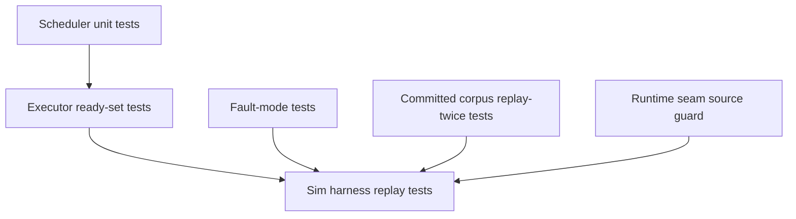

# ADR-013: Deterministic scheduling test coverage

## Status

Accepted

Follow-up to [ADR-008](008-deterministic-simulation-fuzzer.md),
[ADR-010](010-fuzzer-coverage-guidance.md),
[ADR-011](011-guided-interleaving-executor.md), and
[ADR-012](012-tokio-util-cancellation.md).

## Context

ADR-011 moved the concurrency DST onto a small in-repo deterministic executor.
That made schedule replay a function of the schedule tape, fault tape, and seed,
and the existing sim tests already compare byte-identical backend operation
streams for representative workloads.

Those tests are valuable, but they mostly test the whole harness end-to-end.
That leaves several ways to regress without a crisp failure:

- a scheduler can consume bytes off by one, ignore exhausted-tape fallback, or
  drift from the intended PCT demotion semantics;
- a fault tape can stop guiding a concrete fault class while the landed backend
  op stream still happens to match;
- a committed corpus input can preserve the final invariant while replaying a
  different operation stream;
- production engine code can accidentally bypass the `rt` seam with a direct
  `tokio::spawn`, `tokio::time::sleep`, or wall-clock read.

The implementation needs narrower regression checks around those failure modes,
without turning the deterministic executor into a second Tokio implementation or
making the sim suite depend on real timing.

## Decision

Keep the deterministic scheduling design from ADR-011, and strengthen its test
coverage in four layers.

### 1. Pin scheduler semantics

Add exact unit tests in [`exec.rs`](../../crates/glassdb-concurr/src/exec.rs)
for:

- `TapeScheduler` byte consumption, modulo selection, and exhausted-tape
  fallback;
- sorted ready sets handed from the executor to the scheduler;
- PCT seed reproducibility and explicit change-point demotion.

These tests are intentionally small and independent of transaction behavior.
They should fail on scheduler-local bugs before the larger GlassDB workloads are
needed to diagnose them.

### 2. Make fault schedules observable

Add focused tests in
[`fault.rs`](../../crates/glassdb-backend/src/middleware/fault.rs) that force
and assert each transport fault mode:

- tape-guided delay;
- dropped request that does not land;
- lost acknowledgement after a successful landing;
- sustained outage and heal;
- deterministic replay from the same tape and seed.

The sim harness still validates the transaction-level recovery behavior, but
these tests prove the low-level nemesis actually produces the intended events.

### 3. Strengthen sim replay checks

Extend the sim harness ([`sim.rs`](../../crates/glassdb/src/sim.rs)) with
record-and-return entry points that decode fuzz inputs exactly like the fuzz
targets. The committed corpus test
([`fuzz_corpus.rs`](../../crates/glassdb/tests/fuzz_corpus.rs)) replays each
input twice and compares the recorded backend op streams with
`first_divergence`.

Add boundary fixtures to the sim integration tests:

- empty and tiny schedule tapes;
- empty fault tapes;
- read-heavy workloads;
- maximum small generated workload shapes;
- recovery-heavy fault intensities.

This keeps corpus replay as both an invariant check and a determinism check.

### 4. Guard the runtime seam

Add a narrow source-level guard in
[`runtime_seam.rs`](../../crates/glassdb/tests/runtime_seam.rs) for production
engine paths that participate in simulation. It flags direct uses of:

- `tokio::spawn`;
- `tokio::time::sleep`;
- `tokio::time::Instant`;
- `SystemTime::now`.

The guard excludes tests and the approved runtime/clock abstraction files. It is
not a general lint for the whole workspace: cloud backends, benchmarks, and test
code may still use Tokio directly.

## Consequences

- **Sharper failures.** Bugs in schedule-byte consumption, PCT demotion, fault
  mode selection, corpus replay, and runtime-seam use fail near their source.
- **No design change.** The executor remains single-threaded and minimal; the
  new checks document and test the existing contract rather than expanding it.
- **CI coverage improves.** `make test-sim` continues to run the deterministic
  suite, while `make test-all` also covers the runtime seam guard and
  lower-level unit tests.
- **Residual limits remain explicit.** The DST still samples a finite schedule
  space, runs on an in-process memory backend, and does not expose real
  multi-threaded data races, OS scheduling, real cloud SDK behavior, or network
  partitions outside the `Backend` fault model.
