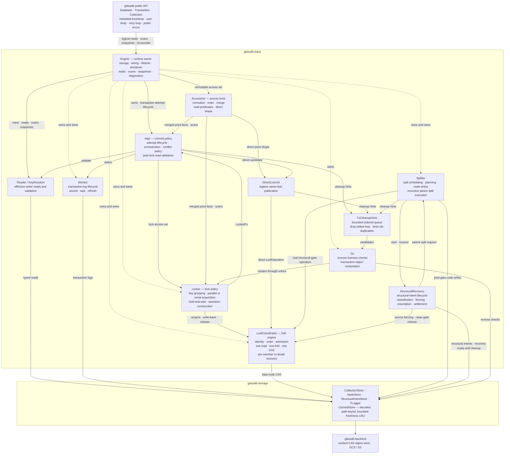
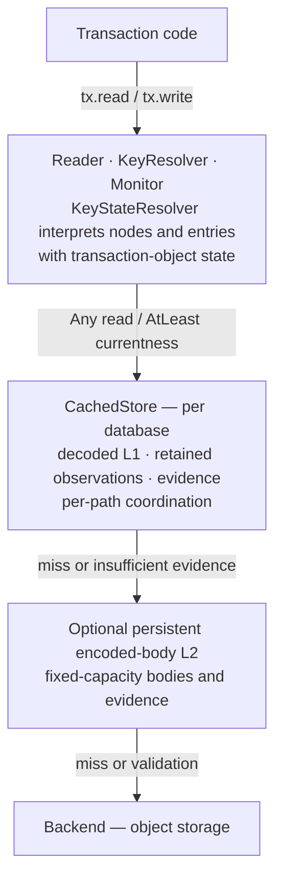
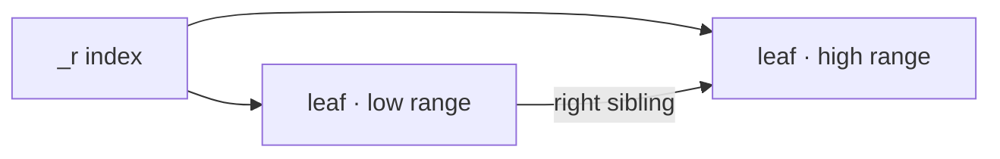

# Architecture

This document describes the current architecture and design choices of GlassDB.
For usage, performance benchmarks, and examples, see the
[README](../README.md).

## Design Goals & Tradeoffs

GlassDB is designed around a specific set of constraints:

- **Stateless clients, no server component.** The entire database is a
  client-side Rust library. There is no server to deploy, no coordinator, and no
  direct communication between clients. All coordination happens through object
  storage.
- **Optimistic locking.** Optimized for workloads where conflicts between
  transactions are rare. Readers are rarely blocked.
- **Strict serializability.** The strongest isolation level — transactions
  behave as if executed one at a time, in an order consistent with real time.
- **Throughput over latency.** Object storage is slow (50–150 ms per
  operation), but highly scalable. GlassDB leverages that parallelism.
- **Object storage as the only dependency.** Requires strong consistency and
  conditional mutations (available in GCS and S3).

The explicit tradeoffs are:

- When transactions race, it's better to be slow than incorrect.
- High throughput is preferred over low latency.
- Values are expected in the 1 KB – 1 MB range.
- Stale reads are allowed if explicitly requested, but strong consistency is the
  default.

## High-Level Architecture

```
┌─────────────┐  ┌─────────────┐  ┌─────────────┐
│  Client A   │  │  Client B   │  │  Client C   │
│ ┌─────────┐ │  │ ┌─────────┐ │  │ ┌─────────┐ │
│ │ App     │ │  │ │ App     │ │  │ │ App     │ │
│ │ Code    │ │  │ │ Code    │ │  │ │ Code    │ │
│ ├─────────┤ │  │ ├─────────┤ │  │ ├─────────┤ │
│ │ GlassDB │ │  │ │ GlassDB │ │  │ │ GlassDB │ │
│ │ Library │ │  │ │ Library │ │  │ │ Library │ │
│ └────┬────┘ │  │ └────┬────┘ │  │ └────┬────┘ │
└──────┼──────┘  └──────┼──────┘  └──────┼──────┘
       │                │                │
       └────────────────┼────────────────┘
                        │
                        ▼
              ┌───────────────────┐
              │  Object Storage   │
              │  (e.g. GCS, S3)   │
              └───────────────────┘
```

Each client embeds GlassDB as a library. Clients are completely independent and
ephemeral — they can scale to zero and back without any coordination. The only
shared state is the object storage bucket, which provides strong consistency for
single-object operations and conditional mutations for atomic state transitions.

## Crate Structure

The Cargo workspace separates the public API, transaction engine, storage,
backend implementations, data types, and concurrency support. Its dependency
DAG is enforced at compile time (for example, `storage` cannot reach into
`trans`):

```
glassdb-data → glassdb-backend → glassdb-storage → glassdb-trans → glassdb
glassdb-proto ─┘                  ↑                      ↑
glassdb-concurr ──────────────────┴──────────────────────┘
glassdb-backend-s3, glassdb-backend-gcs → glassdb (optional, feature-gated)
```

This is the production dependency graph. A `--cfg sim` build adds a
simulation-only edge from `glassdb-data` to the `glassdb-concurr` runtime so
identifier and path entropy comes from the active deterministic run; the edge
is absent from normal library builds.

| Crate                 | Key modules                                                                  | Responsibility                                                                                                                                |
| --------------------- | ---------------------------------------------------------------------------- | --------------------------------------------------------------------------------------------------------------------------------------------- |
| `glassdb`             | `db.rs`, `tx.rs`, `collection.rs`, `iter.rs`, `stats.rs`                     | Public API: `Database`, `Transaction`, `Collection`, iterators, statistics                                                                    |
| `glassdb-backend`     | `lib.rs`, `memory.rs`, `stats.rs`, `middleware/`                             | The `Backend` trait, in-memory backend, stats decorator, and middleware (delay, scheduler, logger, fault, recording)                          |
| `glassdb-backend-s3`  | —                                                                            | Amazon S3 backend (`aws-sdk-s3`), enabled via the `s3` feature                                                                                |
| `glassdb-backend-gcs` | —                                                                            | Google Cloud Storage backend (GCS JSON API), enabled via the `gcs` feature                                                                    |
| `glassdb-trans`       | `engine.rs`, `access.rs`, `algo.rs`, `collection_*`, `collections/`, `tlocker.rs`, `leaf_coord.rs`, `key_*`, `monitor.rs`, `reader.rs`, `split.rs`, `split/recovery.rs`, `gc.rs` | Transaction engine: runtime ownership and assembly, shared access vocabulary, commit algorithm, collection lifecycle, locking, leaf mutation, resolution, monitoring, reads, structural splitting and recovery, and GC |
| `glassdb-storage`     | `cached_store.rs`, `collection_store.rs`, `node_store.rs`, `structural_intent_store.rs`, `tree_router.rs`, `node.rs`, `leaf.rs`, `transaction/`, `txobject.rs`, `cache.rs` | Shared decoded object store with bounded-freshness evidence, separate collection-record, B-link-node, and structural-recovery CAS stores/codecs, B-link traversal, transaction-log persistence, and generic LRU |
| `glassdb-data`        | `txid.rs`, `paths.rs`, `base64.rs`                                           | Core types: `TxId` and order-preserving path encoding                                                                                          |
| `glassdb-proto`       | —                                                                            | `prost`-generated transaction-log protobuf messages                                                                                           |
| `glassdb-concurr`     | `background.rs`, `retry.rs`, `dedup.rs`, `entropy.rs`, `exec.rs`, `exec/`, `rt.rs`, `rt/` | Concurrency utilities: background tasks, retry/backoff, request deduplication, entropy selection, deterministic execution control, and in-run task/time services |

Only the top-level `glassdb` crate is intended for direct use; the rest are
implementation detail. Its public API surface is small: `Database`,
`Transaction`, and `Collection`, plus the re-exported `Backend` trait and the
in-memory backend and middleware. The deterministic-simulation runtime is
compiled only under `--cfg sim`. `glassdb::exec` configures and starts
deterministic runs, while `glassdb::rt` provides task, time, timeout, and
dedicated-task services inside a run. Entropy selection remains in
`glassdb-concurr::entropy`; see [testing-dst.md](guides/testing-dst.md).

The cross-crate transaction boundary is deliberately narrower than the engine's
internal module graph. `glassdb` talks to `glassdb-trans` through `Engine` and
logical access/result types. `Engine` directly owns the runtime graph and its
lifetime. During `Engine::open`, private dormant state opens caches and stores,
verifies the permanent collection, constructs the complete graph, and starts it
only after construction is complete. `Engine` dispatches reads, scans, and
collection snapshots, delegates transaction-attempt lifecycle to `Algo`, and
collects runtime statistics and diagnostics. The public crate retains
metadata/version bootstrap, operation admission, the transaction-body retry loop,
public errors, and public handles. Concrete stores and the routing, locking,
monitoring, splitting, and GC implementations are not exported across this
boundary.

The same engine module supplies the storage, time, monitoring, and task
foundation for focused transaction-engine tests. Production and the Algo tests
extend it into the complete graph. GC, locking, splitting, and leaf-coordination
tests add only the special collaborator that they exercise, so their manual
maintenance steps and backend-operation assertions remain deterministic.

## Component Responsibilities

Inside the transaction engine (`glassdb-trans`) the division of labour separates
transaction orchestration from shared leaf mutation. `Algo` decides *what*
must happen to commit a transaction in terms of logical keys, observed writer
tokens, and staged writes. The `Locker` owns physical routing and acquisition for
the logged protocol. `DirectCommit` owns the narrower logless mechanism: it asks
`TreeRouter` whether a complete point-access member shares one leaf, then
installs that member in the shared coordinator. `Algo` itself routes no key and
CASes no object. (`Reader` is likewise leaf-aware internally but exposes a
path-based API. `Algo` uses `NodeStore` to batch physical point checks and
`KeyResolver` to batch logical point validation.)

`AccessSet` is the immutable access-fact module between the transaction body and
the commit engine. It normalizes point reads and final key writes, keeps their
deterministic order, and exposes one merged point view without a map allocation.
It also owns read and write counts, the read-only projection, point-read
predicates, scan order, and the structural direct-commit shape. `AccessOverlay`
creates it. Routing, locking, validation orchestration, and commit policy stay
outside it.

Every leaf/root entry mutation — lock acquire, direct same-leaf publication,
write-back, release, and GC reclamation — and every leaf structural-gate
acquisition flows through **one leaf coordinator**. It loads the
object once, folds the round's operations in wound-wait order, and CASes once
(ADR-028/029). The coordinator is a transaction-aware shared mutation engine:
it owns identity, ordering, admission, and recovery across the heterogeneous
round, while `Algo`, the `Locker`, and the `Splitter` supply each operation's
target, resolver policy, and typed result as a `LeafOperation`. The operation
types stay with their policy owners; the coordinator exposes one typed
`coordinate` interface and keeps raw resolver submission private.

Independent point-access phases use one transaction-local parallelism value. Each
provider combines work that targets one physical path, then uses bounded
foreground futures with stable input and output order. Waiting work consumes the
bound. GlassDB does not add an aggregate backend scheduler; backend adapters
keep responsibility for queues, connections, retries, and provider throttling
([ADR-064](adr/064-bounded-parallel-point-leaf-work.md)).

`Algo` owns every parallel-to-serial lock transition. It ends the old identity
through the general end path and waits for a durable abort-side status before
it renews the opaque handle. The replacement keeps its priority and cannot
publish until the old identity is terminal. Point and range work continues
without another body execution. Collection changes return `ReplayBody` because
their physical resources belonged to the old identity
([ADR-065](adr/065-renewed-transaction-identity-on-serial-fallback.md)).



Collection management travels beside key access as `CatalogAccesses`: logical
directory reads plus exact create/drop binding changes. `Transaction` overlays
those changes for read-your-writes behavior. `CollectionAttempt` retains those
accesses together with prepared incarnations and fenced drops across same-ID
body retries. `CollectionCommit` owns their recovery-manifest projection,
physical preparation, catalog validation, drop fencing, and physical cleanup.
`Algo` composes those phases with collection and key locking around the same
validation barrier and transaction-log status flip. Directory write-back
materializes committed `name → CollectionId` changes.

Drop additionally freezes the target collection's split topology and installs
the transaction identity as a delete intent on every root, index, and leaf object.
Each structural split records a transaction-log topology backreference and
remains registered in the collection record until its structural intent is
completed or recovered. A freeze can therefore settle every pre-existing
participant before node enumeration.

Normal point operations inspect only the terminal node they already access:
an aborted intent is removable, a pending intent participates in wound-wait,
and a committed intent reports a stale collection handle. Physical
incarnation-unique objects are reclaimed after the logical commit. GC replays
committed directory write-back and collection cleanup independently of whether
the same transaction object still stores a live value; a conditional-delete
conflict retains the durable manifest for a later retry.

Lock ownership is centralized behind two views of `Locker`. The key view takes
logical key accesses and owns node-lock acquisition, write-back, and release.
The collection view takes collection addresses and coordinates directory and
topology locks in collection records. `Locker` constructs and owns that
`CollectionLocker` just as it owns the key view.

`CollectionStateResolver` is the shared mechanism beneath collection semantics
and locking. It loads `CollectionRecord`s, reconciles foreign topology and
directory holders, and helps committed directory write-back. `Engine` gives the
same resolver to `CollectionCatalog` and `Locker`; the catalog therefore depends
on collection-state resolution directly instead of reaching through the whole
locker. It constructs logical snapshots and validates collection preconditions,
but cannot acquire or release locks. This keeps collection-record coordination
out of both the B-link `NodeStore` and the semantic catalog without introducing
a one-implementation capability trait.

`CollectionCommit` is the collection side of transaction commit, not another
locking layer. It owns collection retry-resource bookkeeping, durable manifest
fields, preparation, validation, fencing, and cleanup by composing
`CollectionCatalog` with `CollectionLifecycle`. `CollectionLocker` remains
constructed and owned by `Locker`; `Algo` keeps collection locking beside key
locking so the shared barrier, combined durable lock receipt, atomic commit
point, and write-back ordering remain explicit transaction-wide policy.

Routing traversal is centralized in `TreeRouter`, but use of that mechanism is
intentionally distributed. `KeyResolver`, the key-lock view, `Gc`, and
`Splitter` each own a cheap handle for their distinct read, lock, reclamation,
or structural workflow. A handle contains a cloned `NodeStore`, so all of them
share the same decoded object cache without gaining structural-intent store
capabilities or maintaining independent topology state. The engine module
centralizes their construction, and `Engine` owns the
resulting handles. This does not invent a single semantic owner for those
different routing responsibilities.

`StructuralRecovery` owns each structural intent from its prepared write to
clean deletion or durable recovery. It exposes opaque prepared and Ready
witnesses to split coordination. For recovery, it exposes one resumable action
that classifies phases, fences source writers, checks reachability, cleans
unreachable nodes, and settles finalized topology participants. `Splitter`
only executes a requested recursive parent split and supplies its result back to
the action. It does not inspect durable phases or call `StructuralIntentStore`.

Behind the physical-mutation boundary, every data-node entry mutation and each
leaf structural-gate acquisition flows through a single transaction-aware
`LeafCoordinator`. It owns the protocol shared by a heterogeneous round:
single-flight batching, transaction identity, oldest-first wound-wait order,
routing and capacity admission, whole-member exclusion for overlapping
logless output claims, one CAS, per-member uncertainty attribution, and
reload-and-re-fold recovery. Installed resolvers own the operation-specific
mutation decisions. Each policy owner packages its resolver, target, first-load
requirement, and typed result in a `LeafOperation`: `Locker` supplies acquire /
write-back / release, `DirectCommit` supplies direct commit, `Splitter` supplies
leaf structural-gate acquisition, and `Gc` reclaims through the `Locker`'s
unlock methods (ADR-028/029). The shared coordinator does not interpret these
operation-specific results.
Cross-leaf acquisition strategy, transaction lifecycle, commit orchestration,
GC selection, and structural writes after gate acquisition remain outside the
coordinator.

| Component             | Layer            | Speaks                       | Owns                                                                                                                  | Must not know                       |
| --------------------- | ---------------- | ---------------------------- | --------------------------------------------------------------------------------------------------------------------- | ----------------------------------- |
| `glassdb` (`tx_impl`) | API / retry      | `Engine`, transaction body, `Error`, `BodyDecision` | metadata bootstrap, operation admission, transaction body, body replay, final attempt end, public handles/errors | stores, locks, nodes, tx logs, identity renewal, runtime wiring |
| `Engine`              | runtime owner    | backend, database identity, engine configuration, logical keys, `AccessSet` | cache and store opening, permanent-collection verification, runtime construction and lifetime, dormant-to-live startup, read/scan/catalog entry points, transaction-attempt delegation, shutdown order, runtime stats/diagnostics | transaction bodies, public handles/errors, body retry policy |
| `AccessSet`           | access facts     | point reads, final key writes, range scans | normalization, deterministic order, merged point facts, counts, read-only projection, read predicates, structural direct-commit shape | routing, locking, I/O, commit policy |
| `Algo`                | commit **policy** | `AccessSet`, `TxId`, `LockOutcome`, `BodyDecision`, `TxCleanupHints` | transaction identity and cancellation retirement, direct-vs-logged selection, cross-domain lock→validate→commit→write-back orchestration, **read-version validation** (post-lock), conflict policy (wound restart, deadlock-timeout renewal, serial acquisition, backoff, same-identity normal retry), body-replay decision, GC candidate hints | transaction-body execution, leaf routing, CAS details, caching, collection lifecycle implementation, GC execution, the split mechanism beyond its `SplitHintSink` producer handle |
| `DirectCommit`        | logless commit mechanism | direct point shape, `TxId`, `TreeRouter`, leaf operations, `TxCleanupHints` | one-leaf and physical eligibility, atomic inline/tombstone publication, transaction-local recovery classification, predecessor cleanup hints | access normalization, transaction logs, range/catalog validation, waiting or wounding holders, GC execution |
| `TxCleanupHints`      | maintenance seam | `TxId`                       | bounded ordered cleanup-candidate queue, drop-oldest loss policy, drain-time de-duplication | GC execution, transaction policy, backend storage |
| `CollectionCommit`    | collection-commit **policy** | `CollectionAttempt`, catalog, lifecycle | same-ID collection retry state, recovery and committed-log fields, incarnation preparation, validation, drop fencing, post-commit/abort cleanup | key locking, key validation, the atomic commit decision |
| `Locker::keys`        | key-lock **policy** | merged point facts, scans, `TxId`, B-link nodes | key→leaf grouping, parallel & serial acquisition, hold-and-wait, acquire / write-back / release operations | access normalization, collection-directory semantics |
| `Locker::collections` | collection-lock **policy** | collection addresses, `TxId`, records | directory/topology lock acquisition, recovery write-back and release | key routing, B-link topology, catalog semantics |
| `CollectionStateResolver` | collection-state mechanism | collection addresses, records, `TxId` | resolved record loads, foreign-holder reconciliation, committed directory write-back assistance | key routing, B-link topology, catalog semantics |
| `CollectionCatalog`   | collection semantics | directory reads, binding changes, resolved records | logical snapshots, read-your-writes validation, capacity/precondition checks | locking policy, CAS, wound-wait |
| `LeafCoordinator`    | shared mutation engine | typed `LeafOperation`s | one round per object: single-flight, oldest-first fold, routing/capacity admission, overlapping logless-member exclusion, single CAS, per-member uncertainty, reload-recover, vestigial-entry pruning | operation-specific results, cross-leaf strategy, transaction lifecycle, commit orchestration, GC selection |
| `Splitter`            | structural mechanism | split candidates, opaque structural-intent witnesses and recovery actions | scheduling, topology registration/finalization, source preparation and compaction, split planning, node writes, foreground separator publication, recursive parent split execution | durable intent phases, recovery classification, participant settlement |
| `StructuralRecovery`  | durable recovery mechanism | opaque intent witnesses and resumable parent-split requests | structural-intent creation and phase change, clean deletion, discovery, fencing, reachability classification, orphan cleanup, recovery resumption, participant settlement | split candidates and reasons, tombstone compaction, node split planning, recursive split execution |
| `KeyResolver`         | key/range resolution | logical keys, ranges, `TreeRouter` | routing, scan composition, and input-aligned logical point validation | commit / lock policy, collection-record coordination |
| `KeyStateResolver`    | loaded key-state mechanism | nodes, entries, `TxId` | transaction-dependent interpretation of already-loaded key and node state | routing, scan composition, commit policy |
| `Reader`              | read mechanism   | logical keys, resolved writers | value materialization | commit / lock policy                |
| `Monitor`             | tx lifecycle     | `TxId`, tx logs              | status, wound/abort, lease refresh, waits                                                                             | leaves                              |
| `Gc`                  | maintenance      | `TxCleanupHints`, `TxId`, leaf objects | consumes cleanup hints, mark-sweep GC: reverse liveness check, pin dead tx as wounded, paged shuffled `_t/<ss>/` walks, reclaims via the `Locker`'s coordinator-backed unlock | commit policy                       |

### The lock boundary

The two calls across the semantic/locking seam carry no physical-node
representation:

```rust
// Algo → Locker key view.
async fn lock_at(&self, id: &TxId, accesses: &AccessSet, serial: bool, at: Requirement)
    -> Result<LockOutcome, TransError>;

// Algo → Locker collection view.
async fn lock(
    &self,
    id: &TxId,
    reads: &[DirectoryRead],
    changes: &[CollectionChange],
) -> Result<LockedDirectories, TransError>;
```

- **Down**: the key view receives `AccessSet`, `serial`, and the validation bound; it
  groups keys by current leaf and locks leaves with bounded parallel work or in
  sorted order. The
  collection view receives logical directory reads and binding changes; it
  derives a stable collection-address lock order. Neither interface exposes
  encoded record or node state.
- **Up**: `LockOutcome::Locked(LockedTx)` on success, or `LockOutcome::Conflict`
  when a CAS race was lost — both logical, never nodes. `Algo` maps a normal
  `Conflict` to a complete-access-set retry under the same identity while it
  keeps landed leaf holds. After sustained parallel conflict, `Algo` ends the
  identity, renews it, and continues in serial mode.

Read-version validation is **not** at this seam. Once `Locked` comes back, every
touched key is locked and its value frozen, so `Algo` re-resolves each read's
effective writer (via `Reader`, path-based) and compares it to the token the body
observed. A mismatch means the value moved before the lock landed: `Algo`
returns `ReplayBody` while it **holds its locks**. This is optimistic-concurrency policy
over the logical read set, and it reuses the same routine as the read-only
fast path — so validation lives in exactly one place, never in the locker.

Because the deadlock timeout, serial-escalation decision, and backoff are
*policy*, they live in `Algo`; the locker is bounded only by an internal
CAS-retry budget and reports sustained contention back as `Conflict` rather than
looping forever. `Algo` owns the end/renew lifecycle transition, so the
replacement identity becomes visible only after the old identity is durably
abort-side. This keeps efficient batch acquisition — many keys collapse
into one leaf CAS — behind the key-lock interface.

## Backend Abstraction

The `Backend` trait (`glassdb-backend`) defines the contract with object
storage. It is an `async_trait`, and every method is cancellable by dropping the
returned future:

```rust
#[async_trait]
pub trait Backend: Send + Sync {
    async fn read(&self, path: &str) -> Result<ReadReply, BackendError>;
    async fn read_if_modified(
        &self, path: &str, expected: &Version,
    ) -> Result<ReadReply, BackendError>;
    async fn write_if(
        &self, path: &str, value: Vec<u8>, expected: &Version,
    ) -> Result<Version, BackendError>;
    async fn write_if_not_exists(
        &self, path: &str, value: Vec<u8>,
    ) -> Result<Version, BackendError>;
    async fn delete_if(
        &self, path: &str, expected: &Version,
    ) -> Result<(), BackendError>;
    async fn list(
        &self,
        prefix: &str,
        cursor: Option<&ListCursor>,
        limit: ListLimit,
    ) -> Result<ListPage, BackendError>;
}
```

This is the six-method, conditional-only surface established by
[ADR-042](adr/042-conditional-only-backend-mutations.md), refining the slimmed
backend of [ADR-023](adr/023-slimmed-backend-trait.md). Each method maps to a
primitive S3 and GCS provide natively. All coordination state lives in object
*content*, and every mutation names either absence or an exact content revision
— there are no tags, metadata, writer ids, or unconditional mutations.

Correctness assumes that each backend provides linearizable single-object reads
and conditional mutations, including read-after-definitive-completion. An
eventually consistent backend is therefore not supported. A definitive response
establishes an ordering edge; an `Unavailable` result does not. Provider retries
remain inside one logical backend invocation so that attempts do not manufacture
ordering edges between themselves.

`list` returns one recursive prefix page of actual object paths. `ListLimit` is
positive by construction. `ListCursor` structurally binds an opaque provider
continuation token to its prefix; callers can only retain and return it, while
backend implementations use the documented `backend::implementation` support
module to validate the common prefix binding before provider I/O.
Only a page without a next cursor completes the traversal. A rejected provider
token returns `InvalidCursor`, allowing the caller to restart that prefix. S3
and GCS map this contract directly to their native continuation tokens without
a delimiter
([ADR-035](adr/035-paginated-listing-and-sharded-transaction-logs.md)).

### Key concepts

**Versions.** Every object has an opaque CAS token (`Version { token: Arc<str> }`),
assigned by the backend and used only for conditional operations. The format is
backend-specific: GCS encodes the object `generation`, while S3 uses the
object's ETag. Consumers never interpret it — they pass it back unchanged to
`write_if`, `delete_if`, or `read_if_modified`.

**Change detection.** All coordination state lives in object *content* and
changes only by content CAS. The version (ETag / generation) identifies that
content state; rewriting equivalent content may retain the same token. To check
whether a cached object is current, the cache issues a
*version-conditional* read:
`read_if_modified` takes the expected `Version` and returns `Precondition` when
the stored version still matches (the body is not re-transferred), or the full
object when it changed. This maps to a native conditional GET on every backend
(`If-None-Match` on S3, `ifGenerationNotMatch` on GCS) and lets a hot, unchanged
object check its currentness without a body transfer
([ADR-023](adr/023-slimmed-backend-trait.md)).

**Conditional operations.** `write_if`, `write_if_not_exists`, and `delete_if`
name an expected version (or "must not exist") and fail with
`BackendError::Precondition` if that state is no longer current. A missing
object during `delete_if` is successful convergence whether represented as
success or `NotFound`. Content compare-and-swap (CAS) is the only coordination
primitive — the fundamental building block for distributed coordination.

**Error semantics** (`BackendError`):

- `NotFound` — object does not exist.
- `Precondition` — conditional operation failed (version mismatch).
- `Unavailable(_)` — the operation could not be confirmed. For a *mutation*
  this means the outcome is _in doubt_: it may or may not have been applied
  (e.g. an acknowledgement was lost or an outage exhausted the retry budget),
  so it must not be blindly retried
  ([ADR-009](adr/009-in-doubt-conditional-writes.md)). For an idempotent read or
  list it is a transient failure (`5xx`, timeout, transport error) that is safe
  to retry; the engine retries reads in place and surfaces an unrecoverable one
  as `Error::Unavailable` ([ADR-015](adr/015-read-unavailability.md)).
- `Other(_)` — any other backend error.

`is_not_found`, `is_precondition`, and `is_unavailable` predicates preserve
the original sentinel-error matching semantics.

### Implementations

| Backend                       | Purpose             | Notes                                                                                                                                              |
| ----------------------------- | ------------------- | -------------------------------------------------------------------------------------------------------------------------------------------------- |
| `glassdb-backend-gcs`         | Production          | GCS JSON API over `reqwest`; generation versions; conditional read/write/delete through native generation preconditions                            |
| `glassdb-backend-s3`          | Production          | One object per path (`aws-sdk-s3`); ETag versions; conditional read/write/delete through native HTTP preconditions                                 |
| `glassdb-backend::memory`     | Testing             | In-process `MemoryBackend` simulating GCS semantics                                                                                                |
| `glassdb-backend::middleware` | Debugging / testing | Wrappers for logging, latency injection, byte-driven scheduling, fault injection, and op-stream recording                                          |

The cloud backends are feature-gated (`s3`, `gcs`) so their heavy SDK
dependencies are only pulled in when needed; each is tested against a pure-Rust
in-process fake of its API.

## Transaction Algorithm

### Isolation & Consistency

GlassDB targets **strict serializability** — the combination of serializable
isolation and linearizable consistency. This is the strongest guarantee: all
transactions appear to execute one at a time, in an order consistent with real
time. No anomalies of any kind are possible.

This is achieved by combining two properties:

1. **Linearizable consistency**, provided natively by object storage (GCS, S3):
   any read initiated after a successful write returns that write's contents.
2. **Serializable isolation**, enforced by a modified Strict Two-Phase Locking
   (S2PL) protocol: all locks are held until after commit, preventing
   interleaving.

For a deeper discussion of isolation vs. consistency levels — including
comparisons with Postgres, Spanner, CockroachDB, and others — see the
[blog post](https://blog.mbrt.dev/posts/transactional-object-storage).

### Transaction Lifecycle

```
    ┌───────┐
    │ Begin │  Assign transaction identity, create handle
    └───┬───┘
        │
        ▼
    ┌─────────┐
    │ Execute │  User code runs: reads (tracked), writes (staged locally)
    └───┬─────┘
        │
        ▼
    ┌──────────┐
    │ Validate │  Acquire locks, verify read versions unchanged
    └───┬──────┘
        │
     conflict?
     ╱       ╲
   yes        no
    │          │
    ▼          ▼
 ┌───────┐  ┌────────┐
 │ Retry │  │ Commit │  Write transaction log atomically
 └───────┘  └───┬────┘
                │
                ▼
           ┌─────────┐
           │ Cleanup │  Async: write values back to keys, unlock, GC log
           └─────────┘
```

A transaction progresses through three internal states (`Status` in
`glassdb-trans/src/algo.rs`):

- **New** — transaction is executing user code.
- **Validating** — locks are being acquired and reads verified.
- **Committed** — transaction log written; commit is durable.

During **Execute**, reads go through the cache and are tracked (path + version).
Writes are staged in memory. No locks are held in this phase.

During **Validate**, the algorithm acquires locks and checks that every read
version still matches the current state. If any key was modified by a concurrent
transaction, the current transaction retries — but crucially, it retries with
locks still held, so the second attempt is guaranteed to succeed (at most one
retry).

After **Commit**, the transaction log is the durable record. The async cleanup
phase writes the new values back to keys, releases locks, and schedules the
transaction log for garbage collection.

Because `Database::tx` takes the body by value (`|tx| async move { ... }`) and
the framework owns the retry loop, a conflict simply reruns the closure.
Dropping the transaction future at any point is equivalent to a crash: the
commit protocol and retirement machinery recover any in-flight state.

### Optimistic Concurrency Control

The core idea: **transactions run without locks until commit time.** This means
non-conflicting transactions never interfere with each other.

```
Transaction A (keys 1, 2)         Transaction B (keys 3, 4)
─────────────────────────         ─────────────────────────
Read key 1                        Read key 3
Read key 2                        Read key 4
Stage write to key 1              Stage write to key 3
  ── validate ──                    ── validate ──
Lock key 1, key 2                 Lock key 3, key 4
Verify versions                   Verify versions
Write tx log                      Write tx log
  ── commit ──                      ── commit ──
```

Since A and B touch different keys, they proceed fully in parallel — no waiting,
no retries. Locks are held only for the brief validate-and-commit window.

When transactions _do_ conflict:

1. Both reach the validate phase and try to lock overlapping keys.
2. One wins the lock; the other detects a version mismatch.
3. The loser retries with its locks held (pessimistic fallback), guaranteeing
   progress.

### Distributed Locks

Lock state lives in the **content** of leaf nodes (`_r` for a root leaf or
`_n/<token>` for a standalone leaf), not in object tags. Each leaf body holds a
directory of per-key entries; a locked key's entry
records its lock type, the set of holding transactions, and the key's current
value state (`glassdb-storage/src/leaf.rs`, `lock.rs`):

| Field        | Values                                        | Purpose                                       |
| ------------ | --------------------------------------------- | --------------------------------------------- |
| `lock-type`  | `r`, `w`, `c`, `-`                            | Current lock type (read, write, create, none) |
| `locked-by`  | transaction identities                        | Which transactions hold the lock              |
| `current`    | absent, external, inline, tombstone (+ writer) | Who last wrote this key, and where its value is |

The `current` state is tagged (`CurrentState`,
[ADR-051](adr/051-inline-latest-values.md)): `External` names a writer whose
value lives in its transaction object, `Inline` carries the committed bytes
authoritatively in the entry itself, and `Tombstone` records a committed delete.
A latest read of an inline or tombstoned entry needs no transaction-object read
at all. Inlining is bounded by an `InlinePolicy` (per-value and per-leaf byte
budgets, `DatabaseBuilder::inline_policy`). New inline states are reserved for
logless direct commits, where the leaf is the value's only durable authority
([ADR-054](adr/054-reserve-inline-publication-for-logless-commits.md)). Logged
write-back and help-forwarding publish `External`; an existing inline value is
never demoted because it may have no transaction object.

An unmarked point absence records the routed leaf's membership generation. If
the physical leaf changes, validation requires both continued absence and the
same generation; a tombstone read instead records its exact writer. The
splitter preserves this generation across topology changes and, under its
structural gate, removes holder-free tombstones before its final split decision
([ADR-062](adr/062-splitter-driven-tombstone-reclamation.md)). If compaction
removes the pressure, it persists the smaller leaf and cancels the split;
otherwise the recoverable split partitions the compacted state. Removed writer
transaction identities become ordinary transaction-GC hints.

Lock acquisition is a compare-and-swap on the leaf *object*: read the current
leaf observation, compute the new lock state for every requested key routed to
it, and conditionally rewrite the leaf with `write_if` (the observation's
version or ETag is the precondition). If the observation changed (another
transaction mutated the leaf), the operation retries. Keys are grouped by
routed leaf so many keys collapse into a single GET + CAS (ADR-017/020), and
contending transactions on the same leaf batch through the leaf coordinator into one
owner-driven CAS (ADR-025/026/028) rather than racing separate ones.

A create that reaches the reserved leaf-content limit retries after releasing
its partial locks so the background splitter can make room. The capacity result
starts one 30-second capacity-wait episode: leaf revisions, reroutes, and other
full leaves do not reset it, because acquisition still lacks capacity. A lock
acquisition ends the episode; expiration surfaces an internal capacity error.
This keeps ordinary asynchronous splits retryable without turning an impossible
split, continuous churn, or a grandfathered unsafe entry into an unbounded
foreground wait.

**Compatibility rules** (`LockType`: `None`, `Read`, `Write`, `Create`):

| Requested | Current: None |     Current: Read      | Current: Write | Current: Create |
| --------- | :-----------: | :--------------------: | :------------: | :-------------: |
| Read      |       ✓       |           ✓            |      wait      |      wait       |
| Write     |       ✓       | upgrade if sole holder |      wait      |      wait       |
| Create    |       ✓       |          wait          |      wait      |      wait       |

- Multiple transactions can hold **read** locks simultaneously.
- **Write** locks are exclusive. A read lock can be upgraded to write only if
  the requesting transaction is the sole holder.
- **Create** locks are used when a key doesn't yet exist, to prevent concurrent
  creation.

### Transaction Logs

Each transaction gets its own log object, stored at a deterministic path based
on the transaction identity:

```
<db-prefix>/_t/<first-two-encoded-symbols>/<base64-encoded-tx-id>
```

The transaction identity (`glassdb-data::TxId`) is `[8 bytes random prefix][8 bytes
big-endian UnixNano timestamp]`. The timestamp suffix encodes the wound-wait
priority (earlier = older), while the random prefix leads so that log keys keep
a high-entropy prefix and spread across object-store partitions instead of
clustering sequential commits into one hot partition. The first two encoded
symbols select one of 4,096 independently listable transaction-log shards
([ADR-035](adr/035-paginated-listing-and-sharded-transaction-logs.md)).

The log is serialized as a Protocol Buffer (`glassdb-proto`, `prost`-generated
from a copy of `transaction.proto`) and contains:

- **Status**: pending, committed, wounded, or aborted. `Wounded` is semantically
  aborted but remains pinned until the owner acknowledges retirement as
  `Aborted`.
- **Timestamp**: when the log was last updated.
- **Writes**: list of (path, value, deleted, previous writer) entries (the
  `oneof val_delete` layout is preserved byte-for-byte). Committed values live
  here; lock state lives in the leaf objects, not in the log.

The transaction log serves two critical purposes:

1. **Atomic commit point.** A transaction is committed if and only if its log
   object exists with status "committed". All the multi-key writes become
   durable in a single object write.
2. **Crash recovery synchronization.** Other transactions can inspect a log to
   determine whether a lock holder is still active, and can attempt to abort
   an expired transaction by conditionally writing to its log.

### Commit Protocol

The validate-and-commit sequence:

1. **Parallel lock acquisition.** Lock all read and written keys in parallel.
   Conflicts are resolved by the wound-wait rule (see [Deadlock
   Handling](#deadlock-handling)): an older transaction aborts younger holders,
   a younger one waits. A 5-second timeout (`MAX_DEADLOCK_TIMEOUT`) falls back
   to serial locking only if contention prevents progress. At most the
   configured number of complete leaf operations are incomplete at one time;
   a foreign-holder wait keeps its position.

2. **Version verification.** Optimistic point validation first checks retained
   leaf observations with bounded work on distinct paths. If a physical state
   changed, it resolves the complete logical point-read set. Validation with
   locks held always uses the logical path and treats the transaction's own
   exclusive holder as protection around the predecessor state. If a read
   predicate changed, the transaction retries with locks held.

3. **Write transaction log.** Write the log object atomically. After this point,
   the transaction is considered committed.

4. **Async write-back.** Publish the new current state for each modified key and
   release locks. Original `LockedTx` routed leaf groups run with the same bounded
   parallelism. Split descendants stay serial inside their original position,
   and a local failure does not stop other original groups. A committed value is
   published as an `External` pointer to the
   transaction object, and a delete as a `Tombstone`
   ([ADR-054](adr/054-reserve-inline-publication-for-logless-commits.md)). This
   can happen asynchronously because the transaction log is the source of truth.
   If the client crashes, another transaction can read the log and complete the
   write-back (or just observe the committed values from the log). A live
   structural holder defers to lazy recovery. Failures and deferrals use the
   stable `glassdb::write_back` diagnostic target.

### Optimizations

#### Read-only transactions

If a transaction only reads, it can skip locking entirely on the happy path:

1. Read all keys, tracking their versions.
2. After the last read, verify that all versions are still current and no keys
   are write-locked.
3. If verification passes: return immediately. No locks acquired, no log
   written.
4. If verification fails (concurrent write detected): retry once with the full
   locking protocol as a fallback.

A read is idempotent, so a transient backend outage (`Unavailable`) during a
read is retried in place with backoff by the reader — recovering a blip
transparently without re-running the transaction body. A sustained outage surfaces as
`Error::Unavailable` (distinct from the in-doubt `Error::InDoubt`, which only a
mutation can produce), which the caller may safely retry. See
[ADR-015](adr/015-read-unavailability.md).

This makes read-heavy workloads very efficient — the happy path requires only
one metadata read per key, with zero writes, plus one value read for keys whose
current value is not inline.

#### Same-leaf direct commits

A transaction whose complete point-read and point-write dependency set shares
one leaf can commit in **one** conditional leaf CAS — no lock, transaction
object, or write-back
([ADR-061](adr/061-atomic-logless-single-leaf-commits.md)). The transaction may
read keys other than those it writes and may mix creates, overwrites, and
deletes. Every put becomes `Inline { writer: txid, value }`; every delete becomes
`Tombstone { writer: txid }`. The leaf CAS validates every observed writer and
publishes every output atomically, so it is both the commit point and the
complete durable result. An actual create or delete also advances the leaf's
membership generation once for the whole member.

Direct admission requires all output values to fit the per-value inline limit
and the complete post-state to fit the aggregate and encoded leaf limits. There
is no direct-specific key-count cap. Range scans, collection-catalog operations,
cross-leaf point dependencies, structural or deletion fencing, and live or
unknown holders use the regular [commit protocol](#commit-protocol). Direct
commit never waits for or wounds a holder. A failed multi-key admission does not
request a pressure split because a split could destroy the member's one-leaf
eligibility; the original single-key pressure signal remains available.

A non-landing direct attempt is classified as a whole
([ADR-053](adr/053-replay-definitive-logless-rmw-losses.md)). A read-dependent
member whose loss is certified replays its body under the same, still-unengaged
id; a blind member and a member requiring coordination take the regular locked
path. Within one coordinator round, an earlier direct member claims all of its
output keys. Any later publisher that overlaps those claims is excluded as a
whole, while disjoint direct members may share the same physical leaf CAS.

Recovery remains transaction-local. Seeing any exact inline or tombstone output
marker for this txid proves the entire member landed. With no marker, unchanged
predecessors prove non-landing only when at least one output could not have
collapsed back to that predecessor through tombstone reclamation; an uncertain
all-unmarked-absence delete can therefore become `Error::InDoubt`. Valid reads
may retry direct, while a stale read replays the body. A topology move after an
uncertain CAS is likewise in doubt unless landing was already proved on the
original leaf. Cancellation before dispatch leaves no state, while cancellation
after dispatch is crash-equivalent.

#### Retry with locks held

When a transaction fails validation and must retry, it does so with its locks
still held. This means the second attempt runs under pessimistic locking and is
guaranteed to succeed — no further conflicts are possible. This bounds the
maximum number of retries to one per conflict.

#### Transaction interruption

Snapshot transparency applies to commit outcomes and validated error outcomes.
A panic is not converted into an error outcome: its payload propagates
without read validation or replay, even when that execution observed a stale
snapshot.

An active engine attempt and its retirement guard are one owned resource. The
guard is disarmed only after finalization succeeds. Cancellation or unwinding
synchronously transfers an armed identity to engine-managed retirement, which
forgets process-local lock ownership before control escapes and then settles or
pins the durable identity in waited background work. Physical locks and
prepared collection objects remain recoverable from the transaction manifest
and are released lazily by helpers or garbage collection. Process abort skips
local unwinding and uses the ordinary crash-recovery path.

### Deadlock Handling

GlassDB prevents deadlocks proactively with the **wound-wait** rule. Each
transaction has a priority derived from its ID (an earlier timestamp means an
older, higher-priority transaction). When a transaction requests a lock that
conflicts with current holders:

- If the requester is **older** than a holder, it **wounds** it: the holder's
  log becomes terminal before the requester takes the lock. A foreign or
  ambiguous wound writes pinned `Wounded`; a Database with proof that its local
  victim has retired writes `Aborted` directly.
- If the requester is **younger**, it **waits** for the holder to finish.

Since an older transaction never waits for a younger one, the wait-for graph
stays acyclic and no cycle can form. When `Algo` observes a wound, it ends and
renews the identity (`TxId::renew`) before it asks the database loop to replay
the body. The renewed ID preserves its original priority, so it is not starved.

**Serial locking is kept as a safety net.** Parallel validation still arms a
5-second timeout (`MAX_DEADLOCK_TIMEOUT`); if it fires — meaning sustained
contention, or two equal-priority transactions that wound-wait does not order —
the transaction falls back to **serial validation**, acquiring locks one at a
time in sorted path order. Total ordering cannot deadlock, guaranteeing
progress.

Priority depends only on the ID's timestamp, never on its random prefix, because
`TxId::renew` keeps the timestamp but changes the prefix on each restart;
ordering on the prefix would let equal-timestamp transactions flip order every
restart and livelock. See [ADR-002](adr/002-wound-wait-locking.md).

### Crash Recovery

If a client crashes mid-transaction (or its transaction future is dropped),
other clients can recover. The lifecycle monitor (`glassdb-trans/src/monitor.rs`)
drives this:

1. **Lock TTLs.** While holding locks, a transaction periodically refreshes its
   transaction log with a new timestamp (`PENDING_TX_TIMEOUT` = 15 s, refreshed
   at half that interval). If the timestamp becomes stale (the transaction
   hasn't refreshed within the timeout, allowing for `MAX_CLOCK_SKEW`),
   competing transactions consider the lock expired.

2. **Transaction log as arbiter.** To take over an expired lock, a competing
   transaction conditionally changes the expired transaction's log to
   `Wounded`, including by create-if-absent when the lazy pending object never
   appeared. This is terminal for the transaction but cannot be deleted by GC.
   If the CAS loses to a refresh or commit, the competitor waits longer.

3. **Owner acknowledgement.** A returning owner that proves no operation can
   still publish conditionally changes `Wounded` to `Aborted`; only then does
   finite GC retention apply. If a commit races the wound, CAS semantics ensure
   exactly one wins. A quiescent local victim can write `Aborted` directly.

4. **Local retirement handoff.** Cancellation, unwinding, and failed owner-side
   finalization keep the attempt guard armed. Its synchronous handoff removes
   process-local ownership from diagnostics and admits waited recovery before
   control leaves the owner. A cleanup failure is diagnostic only; durable
   wounds, leases, helping, and GC retain recovery ownership.

## Storage, Caching & Consistency

The decoded object cache is also the coordination boundary for point
operations, not just a performance optimization. Its design combines the
unified typed cache from
[ADR-036](adr/036-decoded-object-cache-with-bounded-freshness.md) with the causal
ordering protocol from
[ADR-043](adr/043-causally-coordinated-backend-operations.md):



All typed physical objects share one byte-weighted, path-keyed LRU under a
single `cache_size` budget. Codecs provide encoding, decoding, and decoded-size
accounting. A physical path has one decoded type; accessing the same path
through another codec is an internal error. Key values are not cached
separately: the reader derives a value from its leaf's effective writer — either
from the inline bytes the leaf already carries, or from that writer's decoded
transaction object.

The LRU (`glassdb-storage/src/cache.rs`) has a 512 MiB default budget,
configurable through `DatabaseBuilder::cache_size`, and evicts least-recently
used entries first. Eviction removes discoverable cache state but does not
revoke observations already retained by readers or transactions.

`DatabaseBuilder::persistent_cache` optionally adds a fixed-capacity L2 in a
caller-selected directory. Its public configuration contains only the directory
and capacity; GlassDB derives the identity from the database name and persistent
database ID. Production geometry uses 64 MiB segments and requires at least
131 MiB. L2 stores exact encoded present bodies, opaque revisions, and their
currentness points, while L1 owns decoded values and live evidence cells.

Filesystem work does not run on Tokio's blocking pool. Cache lookups and
write-behind work share one bounded cache-owned worker, so overload bypasses L2
instead of creating an unbounded blocking-task backlog. Opening and shutdown
are deadline-bounded and fail open; shutdown detaches a stuck worker after its
deadline. The deterministic executor disables L2 until filesystem behavior has
a replayable simulation model.

### Knowledge and causal evidence

`CachedStore` (`glassdb-storage/src/cached_store.rs`) stores only usable
knowledge for a path:

- `Present`, with the decoded value, opaque CAS revision, and currentness
  evidence
- `Absent`, with evidence that non-existence was established definitively

Uncertainty is represented by the absence of a cache entry. There is no stored
`Missing` variant that an ordinary lookup can accidentally reuse. An
`Observation` may retain an exact historical present or absent state and its
evidence after the shared cache entry has been evicted or invalidated. Uncertain
state is not returned as an observation.

Causal evidence is a `SequencePoint`: a strictly ordered event allocated by one
open `Database`. The optional L2 persists points only to chain the next open of
the same database identity after its discoverable cached evidence. Sequence
points are not otherwise exchanged or shared between independent database
opens. Their numeric distance has no semantic meaning, except that the allocator
is coupled to a monotonic elapsed-time floor for the intentionally approximate
`read_stale` age policy.

Callers express the minimum acceptable evidence as a `Requirement`:

| Requirement | Cache state it accepts |
| --- | --- |
| `Any` | Any usable present or absent entry |
| `AtLeast(t)` | Present or absent state proven current at or after `t` |

An observation's `current_after` point is evidence that the observed state was
current at that point. A persisted L2 body retains its original point. Opening
the L2 returns the greatest discoverable point to `Database`, which starts the
new timeline strictly after it and passes that timeline to `CachedStore`. Thus
`Any` may use a persisted body immediately, while every bound allocated in the
new session requires validation until the body's evidence advances.
Finite-staleness cutoffs are clamped to that session boundary for the same
reason. A point is never a claim about response time. A definitive backend
operation contributes its invocation point, allocated immediately before
dispatch. If the same backend state is observed again, its evidence watermark
advances monotonically; a different state replaces the old discoverable
knowledge.

### Per-path operation ordering

`CachedStore` owns a clone-shared `PathCoordinator`. For causally coordinated
point operations, the implementation follows this order:

```text
check cache
-> acquire the path lane
-> check cache again
-> allocate invocation point
-> invoke backend
-> reconcile cache and observations
-> release lane
-> make the future ready
```

The second cache check prevents a waiter from issuing a backend request that an
earlier operation made unnecessary. The invocation point is allocated only
after admission to the lane, so local causal order and backend invocation order
agree. Reconciliation happens before the lane is released and before the
operation can be observed as complete.

Actual backend point calls for the same path do not overlap within one open
database. Calls for different paths remain concurrent, and code must not hold
two path lanes simultaneously. Compatible reads can share one in-flight backend
read; a read may join only when that flight's invocation point satisfies its
requirement. A stricter reader queues and rechecks the cache after the current
flight completes.

An `Any` cache hit deliberately bypasses the lane. It may return older usable
state while a same-path mutation is in flight, but never state already marked
obsolete or uncertain. Code requiring a causal cut uses `AtLeast(t)` instead.

The protocol covers typed single-object reads and conditional mutations.
Listing is not path-coordinated: each page receives its own invocation point,
and a multi-page listing is not a backend snapshot. Database metadata is the
narrow startup-only exception; it uses raw backend operations because it is
created or validated once before normal concurrent access begins.

### Reconciliation and cancellation

Definitive outcomes are published while the path lane is held:

- A successful read installs the exact observed present or absent state.
- A successful create, compare-and-swap, or delete installs the exact resulting
  observation.
- A successful precondition check advances the retained expected observation to
  the mutation's invocation point.
- A clean precondition failure invalidates only matching expected knowledge. It
  proves that state obsolete but normally does not identify its replacement. A
  definitive `NotFound` establishes absence where the operation's semantics make
  that conclusion exact.
- If a changed object's body cannot be decoded, its prior cache entry is
  invalidated; malformed new bytes must not leave stale state discoverable.
- An indeterminate mutation removes all usable knowledge for the path before
  returning `Unavailable`.

Cancellation is part of the protocol. Cancellation while waiting for a lane has
no cache effect because no backend call was invoked. After mutation dispatch, a
`MutationGuard` owns the conservative fallback: if the future is cancelled,
panics, or otherwise exits without definitive reconciliation, it invalidates
the entire path before releasing the lane. The remote mutation may still take
effect later, so local coordination does not pretend to order a subsequent call
after a cancelled remote call. Read cancellation requires no invalidation
because reads cannot change backend state; other readers retry admission if a
shared read flight disappears.

### Assumptions and invariants

The cache and coordinator rely on, and preserve, these properties:

1. Backend single-object reads and conditional mutations are linearizable, and
   a read invoked after a definitive mutation completion observes that mutation
   or a later state.
2. Conditional mutations remain semantically safe if their original predicate
   becomes true again. Revisions describe state and may exhibit ABA;
   create-if-absent is restricted to permanent idempotent paths or fresh
   identity paths whose existence alone cannot publish newer live state.
3. For one open database, no two actual backend point calls for the same
   physical path overlap, except that a cancelled mutation may still be
   executing remotely after local cancellation.
4. A same-path operation is not invoked after an earlier definitive local
   completion until that earlier outcome has been reconciled. Different paths
   have no artificial ordering dependency.
5. A discoverable cache entry always represents usable knowledge. Clean
   conflicts cannot overwrite newer knowledge, while indeterminate or cancelled
   mutations leave the path with no discoverable knowledge.
6. `current_after` never exceeds the invocation point that established it, and
   evidence for an unchanged state advances monotonically.
7. Successful mutations publish the exact installed state. Their callers can
   therefore use the returned observations without immediate verification
   reads.
8. Per-path lanes and sequence points are database-local coordination. L2
   session chaining orders persisted cache evidence but does not share operation
   completion across opens. Independent opens and external writers are governed
   by backend linearizability and conditional revisions, not by a shared
   in-memory timeline.

Transaction execution may use cached state freely before commit. Transaction
validation captures one lower bound and propagates it through leaf and
transaction-object dependencies. A post-bound lock CAS can satisfy that bound
without another read. If a physical leaf changed, validation compares the
observed logical writer or membership with the newer consistent state;
post-bound evidence can therefore save I/O without being mistaken for logical
finality. A typed `TLogger` may serve immutable committed and aborted transaction
objects indefinitely. `Wounded` is terminal for readers but remains mutable to
the owner, so it is revalidated instead of entering that cache. The generic
store does not interpret transaction status.

## Data Model

### Path Encoding

`CollectionPath` values are unresolved sequences of raw names. Resolving one
walks the direct-child directory in each parent record and returns a `Collection`
bound to an opaque 16-byte incarnation ID. Logical keys pair that bound address
with raw key bytes; point operations route by ID without revalidating ancestors.

Only backend objects have type markers (`glassdb-data/src/paths.rs`):

| Type Marker | Meaning                         | Example                           |
| ----------- | ------------------------------- | --------------------------------- |
| `_c`        | Physical collection namespace   | `mydb/_c/<collection-id>`         |
| `_i`        | Collection record                | `mydb/_c/<collection-id>/_i`      |
| `_r`        | Fixed B-link tree root           | `mydb/_c/<collection-id>/_r`      |
| `_n`        | Standalone B-link node           | `mydb/_c/<collection-id>/_n/<token>` |
| `_t`        | Transaction-log object           | `mydb/_t/<log-shard>/<transaction-identity>`|
| `_s`        | Participant-owned structural intent | `mydb/_s/<participant-id>/<intent-id>` |

Collection IDs—not names—are encoded into physical collection namespaces with
the custom **order-preserving** base64 alphabet
(`glassdb-data/src/base64.rs`). Keys live inside leaf objects and remain raw
bytes. Transaction objects store raw keys and collection IDs; the database root
comes from the transaction object's location, so moving a database does not
invalidate its logs.

### Collections

A `Collection` is a scoped namespace for logical keys. The database
has a permanent, key-bearing root collection whose reserved ID is outside the
generated-ID domain. Every collection has an `_i` record containing a bounded,
sorted directory from direct child name to child ID and an independent `_r`
B-link root containing only node state. The parent entry—not physical-object
presence—is authoritative for logical existence.

For a small collection, `_r` is the only leaf. When it splits, `_r` becomes an
index whose children are leaves over contiguous raw-key ranges. Each level has
right-sibling links, so a traversal from cached index state can move right after
a concurrent split and remain correct.



Transactional creation prepares an unreachable record/root pair at a fresh ID,
then publishes `name → ID` through the ordinary commit protocol. A bound
`Collection` routes data directly to `_r` and `_n` without re-reading `_i`.
Collection open, existence, create, drop, and immediate-child listing use the
same transaction machinery as key changes and are exposed as fallible
asynchronous operations.

### Versioning

Two version identities are kept separate (ADR-023):

- **Writer** — the storage-layer `Version` in `glassdb-storage/src/version.rs` is
  writer-only (`data::TxId`): the transaction that last committed the value. A
  value lives in that transaction object's body (ADR-019), so the writer *is* the
  value's identity; the reader uses it to locate the decoded transaction object.
- **Backend version** (`backend::Version`): the opaque CAS token assigned by
  object storage, used for conditional mutations and cache currentness checks
  via the version-conditional `read_if_modified`. It identifies a coordination
  object's content, so the object store wraps it in an opaque `Revision`
  attached to each observation (not in the storage `Version`).

During validation, the algorithm detects concurrent modifications by comparing
the observed writer against the current state; the backend version is the CAS
token for the conditional write that takes the lock.

## Garbage Collection

A transaction object is **live** exactly while some data node or collection
record still references its txid (entry, membership, directory, or topology
coordination), so garbage collection is a reachability problem rather than a
timer. A logless direct commit
([ADR-061](adr/061-atomic-logless-single-leaf-commits.md)) names one or more
inline or tombstone writers that never had an object, which is not a dangling
reference: only existing objects are candidates, and one is dead once nothing
names it. The `Gc` component (`glassdb-trans/src/gc.rs`) implements a
candidate-driven **reverse mark-sweep** ([ADR-022](adr/022-garbage-collection-mark-sweep.md)):

- **Reverse liveness check.** A forward mark (list every leaf, union the
  referenced transaction identities) would cost the whole database per cycle. Instead each
  candidate `_t/` object records its own back-references (its `locks ∪ writes`),
  so GC reads a batch of candidates and confirms each one dead by GET-ing only
  the handful of nodes/records it names — never a database-wide scan.
- **Candidate feed.** `Algo`, `DirectCommit`, and `Splitter` report useful
  reverse-check candidates through one shared `TxCleanupHints` interface. It
  preserves report order, bounds the queue at `HINT_QUEUE_CAP`, drops the oldest
  hint at capacity, and de-duplicates each drained batch. `Gc` consumes the hints
  without exposing its lifecycle or sweep mechanism to producers. Shuffled
  passes over the 4,096 `{db}/_t/<ss>/` prefixes make the candidate set complete
  regardless of lost hints. Each cycle stops after one non-empty page or a
  bounded number of listing requests; an invalid provider cursor restarts only
  its current transaction-log shard.
- **Safety horizon and pinned wounds.** The ADR-021 lease acts as the sweep horizon: a candidate
  within the horizon is always kept, because the non-atomic reverse check can
  race a lock a live transaction has taken but not yet published (ADR-024's lazy
  object materialization). A dead `Pending` object is changed to `Wounded` so
  its death remains durable across an unbounded owner suspension. GC may
  repeatedly reclaim effects described by that record, but cannot delete it.
  The owner changes it to `Aborted` after proving retirement; ordinary finite
  retention and deletion apply only after that acknowledgement (ADR-059).
- **Reclamation through the coordinator.** GC releases a dead transaction's locks
  not with its own CAS but by calling the `Locker`'s per-object unlock methods,
  so the release batches through the same leaf coordinator as live
  traffic (ADR-029); the entry left behind is pruned as a fold property when it
  becomes vestigial (no holder and an absent current state). It retains the candidate
  log observation and conditionally deletes only that exact revision.
- **Background execution.** Sweeps run every `GC_INTERVAL` on the `Background`
  task manager and do not block transaction processing. Background loops are torn
  down via `Drop` when the last `Database` clone is dropped.
