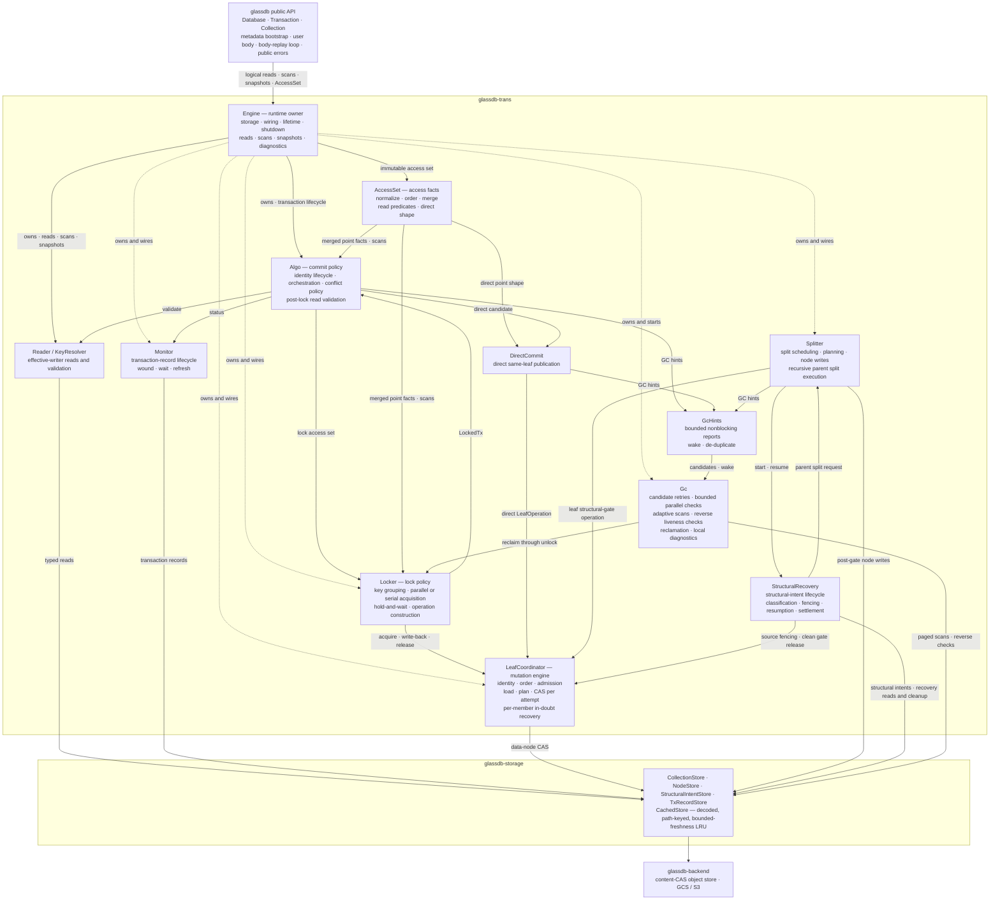
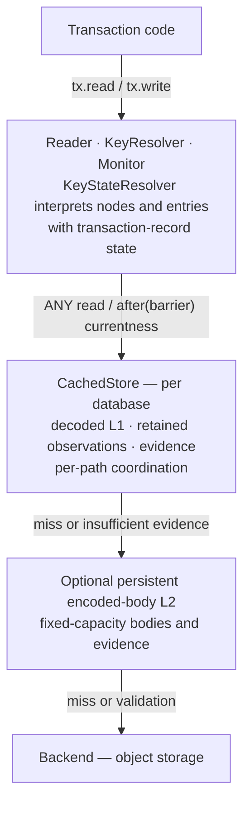
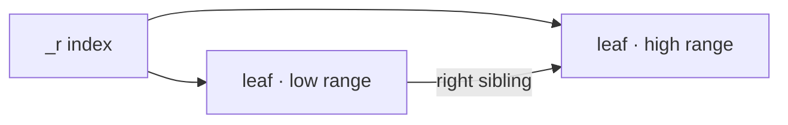

# Architecture

This document describes the current architecture and design choices of GlassDB.
For usage, performance benchmarks, and examples, see the
[README](../README.md).

It stays at the level of structure, algorithms, and responsibility boundaries.
Protocol parameters, module layouts, and type signatures are not repeated here,
because the code states them directly. The [ADRs](adr/) record the decisions
behind each mechanism, the [guides](guides/) explain the cache and evidence
model, and [CONTEXT.md](../CONTEXT.md) defines the vocabulary.

## Design Goals & Tradeoffs

GlassDB is designed around a specific set of constraints:

- **Stateless clients, no server component.** The entire database is a
  client-side Rust library. There is no server to deploy, no coordinator, and no
  direct communication between clients. All coordination happens through object
  storage.
- **Optimistic locking.** Optimized for workloads where conflicts between
  transactions are rare. Readers are rarely blocked.
- **Strict serializability.** The strongest isolation level — transactions
  behave as if executed one at a time, in an order consistent with real time.
- **Throughput over latency.** Object storage is slow (50–150 ms per
  operation), but highly scalable. GlassDB leverages that parallelism.
- **Object storage as the only dependency.** Requires strong consistency and
  conditional mutations (available in GCS and S3).

The explicit tradeoffs are:

- When transactions race, it's better to be slow than incorrect.
- High throughput is preferred over low latency.
- Values are expected in the 1 KB – 1 MB range.
- Stale reads are allowed if explicitly requested, but strong consistency is the
  default.

## High-Level Architecture

```
┌─────────────┐  ┌─────────────┐  ┌─────────────┐
│  Client A   │  │  Client B   │  │  Client C   │
│ ┌─────────┐ │  │ ┌─────────┐ │  │ ┌─────────┐ │
│ │ App     │ │  │ │ App     │ │  │ │ App     │ │
│ │ Code    │ │  │ │ Code    │ │  │ │ Code    │ │
│ ├─────────┤ │  │ ├─────────┤ │  │ ├─────────┤ │
│ │ GlassDB │ │  │ │ GlassDB │ │  │ │ GlassDB │ │
│ │ Library │ │  │ │ Library │ │  │ │ Library │ │
│ └────┬────┘ │  │ └────┬────┘ │  │ └────┬────┘ │
└──────┼──────┘  └──────┼──────┘  └──────┼──────┘
       │                │                │
       └────────────────┼────────────────┘
                        │
                        ▼
              ┌───────────────────┐
              │  Object Storage   │
              │  (e.g. GCS, S3)   │
              └───────────────────┘
```

Each client embeds GlassDB as a library. Clients are completely independent and
ephemeral — they can scale to zero and back without any coordination. The only
shared state is the object storage bucket, which provides strong consistency for
single-object operations and conditional mutations for atomic state transitions.

## Crate Structure

The Cargo workspace separates the public API, transaction engine, storage,
backend implementations, data types, and concurrency support. Its dependency
DAG is enforced at compile time (for example, `storage` cannot reach into
`trans`):

```
glassdb-data → glassdb-backend → glassdb-storage → glassdb-trans → glassdb
glassdb-proto ─┘                  ↑                      ↑
glassdb-concurr ──────────────────┴──────────────────────┘
glassdb-backend-s3, glassdb-backend-gcs → glassdb (optional, feature-gated)
```

A `--cfg sim` build adds a simulation-only edge from `glassdb-data` to the
`glassdb-concurr` runtime, so identifier and path entropy comes from the active
deterministic run. That edge is absent from normal library builds.

| Crate                 | Responsibility                                                                                                                   |
| --------------------- | -------------------------------------------------------------------------------------------------------------------------------- |
| `glassdb`             | Public API: `Database`, `Transaction`, `Collection`, iterators, statistics                                                        |
| `glassdb-backend`     | The `Backend` trait, in-memory backend, stats decorator, and middleware for testing and debugging                                 |
| `glassdb-backend-s3`  | Amazon S3 backend, enabled by the `s3` feature                                                                                    |
| `glassdb-backend-gcs` | Google Cloud Storage backend, enabled by the `gcs` feature                                                                        |
| `glassdb-trans`       | Transaction engine: commit algorithm, collection lifecycle, locking, leaf coordination, reads, structural splitting, and GC       |
| `glassdb-storage`     | Typed object stores over a shared decoded cache with bounded-freshness evidence, B-link traversal, and transaction-record persistence |
| `glassdb-data`        | Core types: transaction identity and order-preserving path encoding                                                               |
| `glassdb-proto`       | Generated transaction-record protobuf messages                                                                                       |
| `glassdb-concurr`     | Concurrency utilities: background tasks, retry, deduplication, entropy, and the deterministic execution runtime                   |

Only the top-level `glassdb` crate is intended for direct use; the rest are
implementation detail. Its public API surface is small: `Database`,
`Transaction`, and `Collection`, plus the re-exported `Backend` trait, the
in-memory backend, and middleware. The deterministic-simulation runtime is
compiled only under `--cfg sim`; see [testing-dst.md](guides/testing-dst.md).

The cross-crate transaction boundary is deliberately narrower than the engine's
internal module graph. `glassdb` talks to `glassdb-trans` through `Engine` and
logical access and result types. `Engine` owns the runtime graph and its
lifetime: it opens caches and stores, constructs the complete graph while it is
still dormant, and starts it only after construction completes. It dispatches
reads, scans, and collection snapshots, delegates the transaction lifecycle to
`Algo`, and collects statistics and diagnostics. The public crate
keeps metadata bootstrap, operation admission, the body-replay loop,
public errors, and public handles. Concrete stores and the routing, locking,
monitoring, splitting, and GC implementations are not exported across this
boundary.

Database metadata owns hard coordination limits and transaction timing. Creation
writes them with the database ID; each open loads them before starting the engine.
A concurrent creator uses the winning metadata. Recovery, refresh, and GC use
the stored timing. Soft split thresholds remain local to each database instance.
Capacity rejections request splits independently of those thresholds, including
parent splits during separator publication and recovery. A capacity hint requests
one split of a divisible node; the blocked operation then retries admission.
Earlier formats require recreation; see
[ADR-072](adr/072-persisted-database-settings.md).

Client key-size limits apply to write admission, including overwrites. Reads,
deletions, and scans ignore this local limit so clients can access keys created
by another database instance.

The database instance does not cap concurrent transaction calls or stale reads.
It tracks active calls so shutdown can reject new calls and wait for existing
calls to finish. The transaction engine drains background protocol work.

## Component Responsibilities

Inside the transaction engine the division of labour separates transaction
orchestration from shared leaf mutation. `Algo` decides *what* must happen to
commit a transaction, in terms of logical keys, observed writers, and
staged writes. The `Locker` owns physical routing and lock acquisition for the
locked commit protocol. `DirectCommit` owns the narrower direct commit
mechanism. `Algo`
itself routes no key and CASes no object.

`AccessSet` is the immutable access-fact module between the transaction body
and the commit engine. It normalizes point reads and final key writes, keeps
their deterministic order, and exposes one merged point view. Routing, locking,
validation orchestration, and commit policy stay outside it.

Every leaf entry mutation — lock acquire, direct same-leaf publication,
write-back, release, and GC reclamation — and every leaf structural-gate
acquisition flows through **one leaf coordinator**. It loads the object once per
attempt, builds a mutation plan in wound-wait order, and persists staged changes
with one CAS (ADR-028/029). The coordinator is a transaction-aware shared
mutation engine: it owns identity, ordering, admission, and recovery across a
heterogeneous round, while `Algo`, the `Locker`, and the `Splitter` supply each
operation's target, resolver policy, and typed result. The operation types stay
with their policy owners: the coordinator reads a member outcome only for
admission, exclusion, and delivery, never for operation-specific policy.

Independent point-access phases use one transaction-local parallelism value.
Each provider combines work that targets one physical path, then uses bounded
foreground futures with stable input and output order. GlassDB does not add an
aggregate backend scheduler; backend adapters keep responsibility for queues,
connections, retries, and provider throttling
([ADR-064](adr/064-bounded-parallel-point-leaf-work.md)).

`Algo` owns every parallel-to-serial lock transition. It ends the old identity
and waits for a durable abort-side status before it renews the opaque handle.
The replacement keeps its priority and cannot publish until the old identity is
terminal. Point and range work continues without another body execution, while
collection changes replay the body because their physical resources belonged to
the old identity
([ADR-065](adr/065-renewed-transaction-identity-on-serial-fallback.md)).



### Collections

Collection management travels beside key access: logical directory reads plus
exact create and drop binding changes. `Transaction` overlays those changes for
read-your-writes behavior, and the same accesses survive body replays under one
transaction identity. `CollectionCommit` owns their recovery-manifest
projection, physical preparation, catalog validation, drop fencing, and physical
cleanup. `Algo` composes those phases with collection and key locking around the
same validation barrier and transaction-record status flip.

A drop additionally freezes the target collection's split topology and installs
the transaction identity as a delete intent on every root, index, and leaf
object, so every pre-existing participant settles before node enumeration.
Normal point operations inspect only the terminal node they already access: an
aborted intent is removable, a pending intent participates in wound-wait, and a
committed intent reports a stale collection handle.

A later drop replaces an aborted or wounded owner's delete intent in the same
revision-checked CAS that installs its own fence, because resolving the old
owner's status does not clear the stored intent and rereading alone cannot make
progress. Other pending holders must still be resolved before that CAS, and a
committed foreign drop rejects the new drop. Cleanup after an aborted drop needs
separate completion evidence for the root, each standalone node, and the
collection record. It must check the topology freeze even when the record
records no directory locks, because an aborted record can record a drop before
its directory lock list is persisted.

A transaction identity owns its collection-ID reservations and prepared
resources. Body replay reuses them, but identity renewal replaces them, so a
renewed identity cannot reuse resources that GC can reclaim for the retired
identity. The engine handle is therefore allocated before the first body
execution, so its identity owns the reservations from the first collection
creation; that allocation is local, and transaction-record publication and
locking still start only when the commit protocol requires them.

Lock ownership is centralized behind two views of `Locker`. The key view takes
logical key accesses and owns node-lock acquisition, write-back, and release.
The collection view takes collection addresses and coordinates directory and
topology locks in collection records.

`CollectionStateResolver` is the shared mechanism beneath collection semantics
and locking. It loads collection records, reconciles foreign topology and
directory holders, and helps committed directory write-back. `Engine` gives the
same resolver to `CollectionCatalog` and `Locker`, so the catalog depends on
collection-state resolution directly instead of reaching through the whole
locker. It constructs logical snapshots and validates collection preconditions,
but cannot acquire or release locks. This keeps collection-record coordination
out of both the B-link `NodeStore` and the semantic catalog.

### Routing and structural change

Routing traversal is centralized in `TreeRouter`, but use of that mechanism is
intentionally distributed. Key resolution, the key-lock view, GC, and the
`Splitter` each own a cheap handle for their distinct read, lock, reclamation,
or structural workflow. A handle shares the same decoded object cache without
gaining structural-intent capabilities or maintaining independent topology
state. This does not invent a single semantic owner for those different routing
responsibilities.

`StructuralRecovery` owns each structural intent from its prepared write to
clean deletion or durable recovery. It exposes opaque witnesses to split
coordination, and one resumable action that classifies phases, fences source
writers, checks reachability, cleans unreachable nodes, and settles finalized
topology participants. `Splitter` only executes a requested recursive parent
split and supplies its result back to the action; it does not inspect durable
phases.

Recovery fences a source writer against the source revision that the intent's
Ready transition recorded, not against the structural gate the source carries
now. A worker publishes its split with one compare-and-swap expecting that
revision, so the revision alone says whether the worker can still land, and a
later split of the same source cannot shield an abandoned intent. Structural
recovery runs on its own background cadence over an independent namespace, and
does not consume the transaction GC candidate queue.

### Ownership summary

| Component             | Layer            | Owns                                                                                                                  | Must not know                       |
| --------------------- | ---------------- | --------------------------------------------------------------------------------------------------------------------- | ----------------------------------- |
| `glassdb` (`tx_impl`) | API / replay     | metadata bootstrap, operation admission, transaction body, body replay, final identity end, public handles and errors | stores, locks, nodes, tx records, identity renewal, runtime wiring |
| `Engine`              | runtime owner    | cache and store opening, runtime construction and lifetime, read/scan/catalog entry points, transaction lifecycle delegation, shutdown order, statistics | transaction bodies, public handles and errors, body-replay policy |
| `AccessSet`           | access facts     | normalization, deterministic order, merged point facts, read-only projection, read predicates, direct-commit shape | routing, locking, I/O, commit policy |
| `Algo`                | commit **policy** | transaction identity and retirement, direct-vs-locked selection, lock→validate→commit→write-back orchestration, **post-lock read validation**, conflict policy, body-replay decision, GC candidate hints | transaction-body execution, leaf routing, CAS details, caching, collection lifecycle implementation, GC execution |
| `DirectCommit`        | direct commit mechanism | one-leaf and physical eligibility, atomic inline/tombstone publication, transaction-local recovery classification | access normalization, transaction records, range and catalog validation, waiting or wounding holders |
| `GcHints`             | GC candidate seam | bounded nonblocking candidate reports, observable hint loss, wakeups and de-duplication | GC execution, transaction policy, backend storage |
| `CollectionCommit`    | collection-commit **policy** | same-identity collection replay state, durable manifest fields, incarnation preparation, validation, drop fencing, post-commit and post-abort cleanup | key locking, key validation, the atomic commit decision |
| `Locker::keys`        | key-lock **policy** | key→leaf grouping, parallel and serial acquisition, hold-and-wait, acquire / write-back / release operations | access normalization, collection-directory semantics |
| `Locker::collections` | collection-lock **policy** | directory and topology lock acquisition, recovery write-back and release | key routing, B-link topology, catalog semantics |
| `CollectionStateResolver` | collection-state mechanism | resolved record loads, foreign-holder reconciliation, committed directory write-back assistance | key routing, B-link topology, catalog semantics |
| `CollectionCatalog`   | collection semantics | logical snapshots, read-your-writes validation, capacity and precondition checks | locking policy, CAS, wound-wait |
| `LeafCoordinator`     | shared mutation engine | one round per object: batching, oldest-first mutation planning, routing and capacity admission, exclusion of overlapping direct members, one CAS per attempt, per-member in-doubt state, reload-recover, vestigial-entry pruning | operation-specific results, cross-leaf strategy, transaction lifecycle, commit orchestration, GC selection |
| `Splitter`            | structural mechanism | scheduling, topology registration and finalization, source preparation and compaction, split planning, node writes, separator publication | durable intent phases, recovery classification, participant settlement |
| `StructuralRecovery`  | durable recovery mechanism | intent creation and phase change, clean deletion, discovery, fencing, reachability classification, orphan cleanup, participant settlement | split candidates and reasons, tombstone compaction, node split planning |
| `KeyResolver`         | key/range resolution | routing, scan composition, and logical point validation | commit and lock policy, collection-record coordination |
| `KeyStateResolver`    | loaded key-state mechanism | transaction-dependent interpretation of already-loaded key and node state | routing, scan composition, commit policy |
| `Reader`              | read mechanism   | value materialization                                                                                                 | commit and lock policy             |
| `Monitor`             | tx lifecycle     | status, wound and abort, lease refresh, waits                                                                         | leaves                              |
| `Gc`                  | GC scheduling and reclamation | bounded queues and checks, deferred retries, adaptive scans, reverse liveness checks, safety horizons, pinned wounds, reclamation through the coordinator, statistics | commit policy, structural recovery |

### Leaf coordination terms

The [glossary](../CONTEXT.md#leaf-coordination) defines **coordinator round**,
**round member**, and **mutation plan**. Within a round:

| Work | Term | Meaning |
| --- | --- | --- |
| Combine compatible submissions for one leaf | Batch submissions | Form or extend a coordinator round. This does not evaluate the operations or prove that they can all stage changes. |
| Obtain one member's decision | Evaluate a resolver | Ask the member's resolver to propose all of its changes, or none, against the current staged entries. |
| Build one attempt's proposed leaf state | Build a mutation plan | Check routing and publication claims, evaluate admitted resolvers in priority order, and admit their proposed changes within the leaf's capacity limits. Later resolvers see earlier admitted changes. |
| Store the proposed changes | Persist a mutation plan | Issue one conditional leaf mutation if any member staged changes. A plan with no staged changes retains the loaded observation without a CAS. |
| Recover after contention or an in-doubt result | Reload and rebuild the mutation plan | Load another leaf observation and repeat planning, while retaining each member's unresolved in-doubt state. |

Priority order means oldest wound-wait priority first, with transaction-identity
bytes as a deterministic tie-break within the round. A later member cannot wound
an earlier member, and the tie-break does not change persistent wound-wait
priority. Each member's changes pass admission together or not at all. Resolver
evaluation can consult transaction state and perform protocol work, such as
wounding a holder, so building a mutation plan is not a pure computation; but it
does not itself persist the proposed leaf state. An outcome proposed with staged
changes is delivered only after the CAS succeeds, and a member skipped because
an earlier member already staged its change must wait for the same CAS.

Earlier revisions used **fold** for several of these steps. Code, guides, and
ADRs now use the specific terms above.

### The lock boundary

The two calls across the semantic/locking seam carry no physical-node
representation:

- **Down**: the key view receives the access set, the serial flag, and the
  validation bound; it groups keys by current leaf and locks leaves with bounded
  parallel work or in sorted order. The collection view receives logical
  directory reads and binding changes, and derives a stable collection-address
  lock order. Neither interface exposes encoded record or node state.
- **Up**: success returns a locked-transaction handle, and a lost CAS race
  returns a conflict — both logical, never nodes. `Algo` maps a normal conflict
  to a complete-access-set body replay under the same identity while it keeps landed
  leaf holds. After sustained parallel conflict, `Algo` ends the identity, renews
  it, and continues in serial mode.

Read-writer validation is **not** at this seam. Once the locks come back, every
touched key is locked and its value frozen, so `Algo` re-resolves each read's
effective writer and compares it to the token the body observed. A mismatch
means the value moved before the lock landed, and `Algo` replays the body while
it **holds its locks**. This is optimistic-concurrency policy over the logical
read set, and it reuses the same routine as optimistic validation — so
validation lives in exactly one place, never in the locker.

Because the deadlock timeout, serial-escalation decision, and backoff are
*policy*, they live in `Algo`. The locker is bounded only by an internal
CAS-retry budget and reports sustained contention back as a conflict rather than
looping forever. This keeps efficient batch acquisition — many keys collapse
into one leaf CAS — behind the key-lock interface.

## Backend Abstraction

The `Backend` trait defines the contract with object storage. It is an
`async_trait`, and every method is cancellable by dropping the returned future.
Six methods form a conditional-only surface
([ADR-042](adr/042-conditional-only-backend-mutations.md), refining
[ADR-023](adr/023-slimmed-backend-trait.md)): read, revision-conditional read,
compare-and-swap write, create-if-absent write, conditional delete, and
paginated prefix listing. Each maps to a primitive that S3 and GCS provide
natively. All coordination state lives in object *content*, and every mutation
names either absence or an exact content revision — there are no tags,
metadata, writer ids, or unconditional mutations.

Correctness assumes that each backend provides linearizable single-object reads
and conditional mutations, including read-after-definitive-completion. An
eventually consistent backend is therefore not supported. A definitive response
establishes an ordering edge; an `Unavailable` result does not. Provider retries
remain inside one logical backend invocation, so attempts do not manufacture
ordering edges between themselves.

Listing returns one recursive prefix page of actual object paths. A cursor
structurally binds an opaque provider continuation token to its prefix; callers
can only retain and return it. Only a page without a next cursor completes the
traversal, and a rejected provider token lets the caller restart that prefix.
S3 and GCS map this contract directly to their native continuation tokens
without a delimiter
([ADR-035](adr/035-paginated-listing-and-sharded-transaction-logs.md)).

### Key concepts

**Revisions.** Every object has an opaque revision assigned by the backend and
used only for conditional operations. The format is backend-specific: GCS
encodes the object generation, while S3 uses the object's ETag. Consumers never
interpret it — they pass it back unchanged to a conditional operation.

**Change detection.** All coordination state lives in object *content* and
changes only by content CAS. The revision identifies that content state;
rewriting equivalent content may retain the same token. To check whether a
cached object is current, the cache issues a *revision-conditional* read: the
backend returns a precondition failure when the stored revision still matches
(without re-transferring the body), or the full object when it changed. This
maps to a native conditional GET on every backend and lets a hot, unchanged
object check its currentness without a body transfer
([ADR-023](adr/023-slimmed-backend-trait.md)).

**Conditional operations.** Conditional writes and deletes name an expected
revision (or "must not exist") and fail if that state is no longer current. A
missing object during a conditional delete is successful convergence. Content
compare-and-swap is the only coordination primitive — the fundamental building
block for distributed coordination.

**Error semantics.** The backend distinguishes four outcomes:

- `NotFound` — the object does not exist.
- `Precondition` — a conditional operation failed because the state moved.
- `Unavailable` — the operation could not be confirmed. For a *mutation* this
  means the outcome is _in doubt_: it may or may not have been applied, so it
  must not be blindly retried
  ([ADR-009](adr/009-in-doubt-conditional-writes.md)). For an idempotent read or
  list it is a transient failure that is safe to retry; the engine retries reads
  in place and surfaces an unrecoverable one as an unavailability error
  ([ADR-015](adr/015-read-unavailability.md)).
- `Other` — any other backend error.

### Implementations

| Backend                       | Purpose             | Notes                                                                                             |
| ----------------------------- | ------------------- | --------------------------------------------------------------------------------------------------- |
| `glassdb-backend-gcs`         | Production          | GCS JSON API; generation revisions; conditional read, write, and delete through native preconditions |
| `glassdb-backend-s3`          | Production          | One object per path; ETag revisions; conditional read, write, and delete through native preconditions |
| `glassdb-backend::memory`     | Testing             | In-process backend simulating GCS semantics                                                        |
| `glassdb-backend::middleware` | Debugging / testing | Wrappers for logging, latency injection, byte-driven scheduling, fault injection, and op recording |

The cloud backends are feature-gated so their heavy SDK dependencies are only
pulled in when needed; each is tested against a pure-Rust in-process fake of its
API. Memory, GCS, and S3 share a backend conformance suite; provider-specific
tests check transport faults and in-doubt mutation outcomes. The PR diagnostic
benchmarks wrap the in-memory backend with modeled
provider latency and throttling on a scaled clock; see
[the diagnostic benchmark conditions](../crates/glassdb/benches/README.md).

## Transaction Algorithm

### Isolation & Consistency

GlassDB targets **strict serializability** — the combination of serializable
isolation and linearizable consistency. This is the strongest guarantee: all
transactions appear to execute one at a time, in an order consistent with real
time. No anomalies of any kind are possible.

This is achieved by combining two properties:

1. **Linearizable consistency**, provided natively by object storage (GCS, S3):
   any read initiated after a successful write returns that write's contents.
2. **Serializable isolation**, enforced by a modified Strict Two-Phase Locking
   (S2PL) protocol: all locks are held until after commit, preventing
   interleaving.

For a deeper discussion of isolation vs. consistency levels — including
comparisons with Postgres, Spanner, CockroachDB, and others — see the
[blog post](https://blog.mbrt.dev/posts/transactional-object-storage).

### Transaction Lifecycle

```
    ┌───────┐
    │ Begin │  Assign transaction identity, create handle
    └───┬───┘
        │
        ▼
    ┌─────────┐
    │ Execute │  User code runs: reads (tracked), writes (staged locally)
    └───┬─────┘
        │
        ▼
    ┌──────────┐
    │ Validate │  Acquire locks, verify observed writers unchanged
    └───┬──────┘
        │
     conflict?
     ╱       ╲
   yes        no
    │          │
    ▼          ▼
 ┌────────┐ ┌────────┐
 │ Replay │ │ Commit │  Write transaction record atomically
 └────────┘ └───┬────┘
                │
                ▼
           ┌─────────┐
           │ Cleanup │  Async: write values back to keys, unlock, GC record
           └─────────┘
```

During **Execute**, reads go through the cache and are tracked, and writes are
staged in memory. No locks are held in this phase.

During **Validate**, the algorithm acquires locks and checks that every
observed writer still matches the current state. If any key was modified by a
concurrent transaction, the current transaction replays the body — but
crucially, it does so with locks still held, so the second pass is guaranteed
to succeed (at most one body replay).

After **Commit**, the transaction record is the durable commit point. The async
cleanup phase writes the new values back to keys, releases locks, and schedules
the transaction record for garbage collection.

Because `Database::tx` takes the body by value and the framework owns the
body-replay loop, a conflict simply replays the body. Dropping the transaction
future at any point is equivalent to a crash: the commit protocol and retirement
machinery recover any in-flight state.

### Optimistic Concurrency Control

The core idea: **transactions run without locks until commit time.** This means
non-conflicting transactions never interfere with each other.

```
Transaction A (keys 1, 2)         Transaction B (keys 3, 4)
─────────────────────────         ─────────────────────────
Read key 1                        Read key 3
Read key 2                        Read key 4
Stage write to key 1              Stage write to key 3
  ── validate ──                    ── validate ──
Lock key 1, key 2                 Lock key 3, key 4
Verify writers                    Verify writers
Write tx record                   Write tx record
  ── commit ──                      ── commit ──
```

Since A and B touch different keys, they proceed fully in parallel — no waiting,
no body replays. Locks are held only for the brief validate-and-commit window.

When transactions _do_ conflict:

1. Both reach the validate phase and try to lock overlapping keys.
2. One wins the lock; the other detects a writer mismatch.
3. The loser replays the body with its locks held (pessimistic fallback),
   guaranteeing progress.

### Distributed Locks

Lock state lives in the **content** of leaf nodes, not in object tags. Each leaf
body holds a directory of per-key entries; a locked key's entry records its lock
type, the set of holding transactions, and the key's current value state:

| Field        | Values                                        | Purpose                                       |
| ------------ | --------------------------------------------- | --------------------------------------------- |
| lock type    | read, write, create, none                     | Current lock type                             |
| holders      | transaction identities                        | Which transactions hold the lock              |
| current      | absent, external, inline, tombstone (+ writer) | Who last wrote this key, and where its value is |

The current state is tagged
([ADR-051](adr/051-inline-latest-values.md)): *external* names a writer whose
value lives in its transaction record, *inline* carries the committed bytes
authoritatively in the entry itself, and *tombstone* records a committed delete.
A latest read of an inline or tombstoned entry needs no transaction-record read
at all. Inlining is bounded by a configurable per-value and per-leaf byte
budget. New inline states are reserved for direct commits, where the leaf is the
value's only durable authority
([ADR-054](adr/054-reserve-inline-publication-for-logless-commits.md)). Locked
write-back and help-forwarding publish an external pointer; an existing inline
value is never demoted, because it may have no transaction record.

An unmarked point absence records the routed leaf's membership generation. If
the physical leaf changes, validation requires both continued absence and the
same generation; a tombstone read instead records its exact writer. The splitter
preserves this generation across topology changes and, under its structural
gate, removes holder-free tombstones before its final split decision
([ADR-062](adr/062-splitter-driven-tombstone-reclamation.md)). If compaction
removes the pressure, it persists the smaller leaf and cancels the split;
otherwise the recoverable split partitions the compacted state.

Lock acquisition is a compare-and-swap on the leaf *object*: read the current
leaf observation, compute the new lock state for every requested key routed to
it, and conditionally rewrite the leaf. If the observation changed, the
operation retries. Keys are grouped by routed leaf so many keys collapse into a
single GET + CAS (ADR-017/020), and contending transactions on the same leaf
batch through the leaf coordinator into one owner-driven CAS (ADR-025/026/028)
rather than racing separate ones.

A create that reaches the reserved leaf-content limit retries after releasing
its partial locks, so the background splitter can make room. The capacity result
starts one bounded capacity-wait episode: leaf revisions, reroutes, and other
full leaves do not reset it, because acquisition still lacks capacity. This
keeps ordinary asynchronous splits retryable without turning an impossible
split, continuous churn, or a grandfathered unsafe entry into an unbounded
foreground wait.

**Compatibility rules**:

| Requested | Current: None |     Current: Read      | Current: Write | Current: Create |
| --------- | :-----------: | :--------------------: | :------------: | :-------------: |
| Read      |       ✓       |           ✓            |      wait      |      wait       |
| Write     |       ✓       | upgrade if sole holder |      wait      |      wait       |
| Create    |       ✓       |          wait          |      wait      |      wait       |

- Multiple transactions can hold **read** locks simultaneously.
- **Write** locks are exclusive. A read lock can be upgraded to write only if
  the requesting transaction is the sole holder.
- **Create** locks are used when a key doesn't yet exist, to prevent concurrent
  creation.

### Transaction Records

Each transaction gets its own record object, stored at a deterministic path
derived from the transaction identity:

```
<db-prefix>/_t/<first-encoded-symbol>/<second-encoded-symbol>/<base64-encoded-tx-id>
```

The transaction identity is a random prefix followed by a big-endian nanosecond
timestamp. The timestamp suffix encodes the wound-wait priority (earlier =
older), while the random prefix leads so that record keys keep a high-entropy
prefix and spread across object-store partitions instead of clustering
sequential commits into one hot partition. The first two encoded symbols form
separate path segments, so recursive LIST requests can scan the root, one of 64
prefixes, or one of 4,096 prefixes without moving objects
([ADR-070](adr/070-demand-driven-garbage-collection.md)). Older layouts have no
migration path and must be recreated; mixed operation with older binaries is
unsupported.

The record is serialized as a Protocol Buffer and contains:

- **Status**: pending, committed, wounded, or aborted. `Wounded` is semantically
  aborted but remains pinned until the owner acknowledges retirement as
  `Aborted`.
- **Timestamp**: when the record was last updated.
- **Writes**: the committed values, with their paths and previous writers. Lock
  state lives in the leaf objects, not in the record.

The transaction record serves two critical purposes:

1. **Atomic commit point.** A transaction is committed if and only if its
   record object exists with status "committed". All the multi-key writes become
   durable in a single object write.
2. **Crash recovery synchronization.** Other transactions can inspect a record
   to determine whether a lock holder is still active, and can attempt to abort
   an expired transaction by conditionally writing to its record.

### Commit Protocol

The validate-and-commit sequence:

1. **Parallel lock acquisition.** Lock all read and written keys in parallel,
   with a bound on the number of incomplete leaf operations. Conflicts are
   resolved by the wound-wait rule (see [Deadlock
   Handling](#deadlock-handling)): an older transaction aborts younger holders,
   a younger one waits. A deadlock timeout falls back to serial locking only if
   contention prevents progress.

2. **Writer verification.** Optimistic point validation first checks retained
   leaf observations. If a physical state changed, it resolves the complete
   logical point-read set. Validation with locks held always uses the logical
   path and treats the transaction's own exclusive holder as protection around
   the predecessor state. If a read predicate changed, the transaction replays
   the body with locks held.

3. **Write transaction record.** Write the record object atomically. After this
   point, the transaction is considered committed.

4. **Async write-back.** Publish the new current state for each modified key and
   release locks, with the same bounded parallelism over routed leaf groups. A
   committed value is published as an external pointer to the transaction
   record, and a delete as a tombstone
   ([ADR-054](adr/054-reserve-inline-publication-for-logless-commits.md)). This
   can happen asynchronously because the transaction record is the source of
   truth. If the client crashes, another transaction can read the record and
   complete the write-back, or just observe the committed values from the
   record. A live
   structural holder defers to lazy recovery.

### Optimizations

#### Read-only transactions

If a transaction only reads, it can use optimistic validation:

1. Read all keys, tracking their writers.
2. After the last read, verify that all writers are still current and no keys
   are write-locked.
3. If verification passes: return immediately. No locks acquired, no record
   written.
4. If verification fails (concurrent write detected): fall back once to the full
   locked commit protocol.

A read is idempotent, so a transient backend outage during a read is retried in
place with backoff by the reader — recovering a blip transparently without
replaying the body. A sustained outage surfaces as an
unavailability error, distinct from the in-doubt error that only a mutation can
produce, which the caller may safely retry. See
[ADR-015](adr/015-read-unavailability.md).

This makes read-heavy workloads very efficient — optimistic validation requires only
one metadata read per key, with zero writes, plus one value read for keys whose
current value is not inline.

#### Same-leaf direct commits

A transaction whose complete point-read and point-write dependency set shares
one leaf can commit in **one** conditional leaf CAS — no lock, transaction
record, or write-back
([ADR-061](adr/061-atomic-logless-single-leaf-commits.md)). The transaction may
read keys other than those it writes and may mix creates, overwrites, and
deletes. Every put becomes an inline value and every delete a tombstone, both
naming the transaction as writer. The leaf CAS validates every observed writer
and publishes every output atomically, so it is both the commit point and the
complete durable result.

Direct admission requires all output values to fit the per-value inline limit
and the complete post-state to fit the aggregate and encoded leaf limits. There
is no direct-specific key-count cap. Range scans, collection-catalog operations,
cross-leaf point dependencies, structural or deletion fencing, and live or
unknown holders use the locked [commit protocol](#commit-protocol). Direct
commit never waits for or wounds a holder. A failed multi-key admission does not
request a pressure split, because a split could destroy the member's one-leaf
eligibility; the single-key pressure signal remains available.

A non-landing direct outcome is classified as a whole
([ADR-053](adr/053-replay-definitive-logless-rmw-losses.md)). A read-dependent
member whose loss is certified replays its body under the same, still-unengaged
identity; a blind member and a member requiring coordination take the locked
commit path. Within one coordinator round, an earlier direct member claims all
of its output keys, so any later overlapping publisher is excluded as a whole,
while disjoint direct members may share the same physical leaf CAS.

Recovery remains transaction-local. Seeing any exact inline or tombstone output
marker for this identity proves the entire member landed. With no marker,
unchanged predecessors prove non-landing only when at least one output could not
have collapsed back to that predecessor through tombstone reclamation, so an
all-unmarked-absence delete that remains in doubt can surface as an in-doubt
error. Valid reads
may retry direct, while a stale read replays the body. If pruning a finalized
membership holder changes the temporary generation and read validation fails,
the locked commit path makes that cleanup durable, because replaying against a
generation change that was never stored would repeat the same failure.
Cancellation before dispatch leaves no state, while cancellation after dispatch
is crash-equivalent.

#### Body replay with locks held

When a transaction fails validation, it replays the body with its locks still
held. This means the second pass runs under pessimistic locking and is
guaranteed to succeed — no further conflicts are possible. This bounds body
replays to one per conflict.

#### Transaction interruption

Snapshot transparency applies to commit outcomes and validated error outcomes.
A panic is not converted into an error outcome: its payload propagates without
read validation or replay, even when that execution observed a stale snapshot.

An active transaction identity and its retirement guard are one owned resource.
The guard is disarmed only after finalization succeeds. Cancellation or unwinding
synchronously transfers an armed identity to engine-managed retirement, which
forgets process-local lock ownership before control escapes and then settles or
pins the durable identity in waited background work. Physical locks and prepared
collection objects remain recoverable from the transaction manifest and are
released lazily by helpers or garbage collection. Process abort skips local
unwinding and uses the ordinary crash-recovery path.

### Deadlock Handling

GlassDB prevents deadlocks proactively with the **wound-wait** rule. Each
transaction has a priority derived from its identity (an earlier timestamp means
an older, higher-priority transaction). When a transaction requests a lock that
conflicts with current holders:

- If the requester is **older** than a holder, it **wounds** it: the holder's
  record becomes terminal before the requester takes the lock. A foreign or
  in-doubt wound writes a pinned `Wounded` status; a Database with proof that
  its local victim has retired writes `Aborted` directly.
- If the requester is **younger**, it **waits** for the holder to finish.

Since an older transaction never waits for a younger one, the wait-for graph
stays acyclic and no cycle can form. When `Algo` observes a wound, it ends and
renews the identity before it asks the database loop to replay the body. The
renewed identity preserves its original priority, so it is not starved.

**Serial locking is kept as a safety net.** Parallel validation arms a deadlock
timeout; if it fires — meaning sustained contention, or two equal-priority
transactions that wound-wait does not order — the transaction falls back to
**serial validation**, acquiring locks one at a time in sorted path order. Total
ordering cannot deadlock, guaranteeing progress.

Priority depends only on the identity's timestamp, never on its random prefix,
because renewal keeps the timestamp but changes the prefix on each identity
renewal; ordering on the prefix would let equal-timestamp transactions flip order
every identity renewal and livelock. See [ADR-002](adr/002-wound-wait-locking.md).

### Crash Recovery

If a client crashes mid-transaction (or its transaction future is dropped),
other clients can recover. The lifecycle monitor drives this:

1. **Lock leases.** While holding locks, a transaction periodically refreshes
   its transaction record with a new timestamp, at half the pending-transaction
   timeout. If the timestamp becomes stale, allowing for a bounded clock skew,
   competing transactions consider the lock expired.

2. **Transaction record as arbiter.** To take over an expired lock, a competing
   transaction conditionally changes the expired transaction's record to
   `Wounded`, including by create-if-absent when the lazy pending record never
   appeared. This is terminal for the transaction but cannot be deleted by GC.
   If the CAS loses to a refresh or commit, the competitor waits longer.

3. **Owner acknowledgement.** A returning owner that proves no operation can
   still publish conditionally changes `Wounded` to `Aborted`; only then does
   finite GC retention apply. If a commit races the wound, CAS semantics ensure
   exactly one wins. A confirmed wound renews the transaction identity and
   replays its body; local pending state cannot rule out a peer's wound.

4. **Local retirement handoff.** Cancellation, unwinding, and failed owner-side
   finalization keep the identity retirement guard armed. Its synchronous handoff removes
   process-local ownership from diagnostics and admits waited recovery before
   control leaves the owner. A cleanup failure is diagnostic only; durable
   wounds, leases, helping, and GC retain recovery ownership.

## Storage, Caching & Consistency

The decoded object cache is also the coordination boundary for point
operations, not just a performance optimization. Its design combines the
unified typed cache from
[ADR-036](adr/036-decoded-object-cache-with-bounded-freshness.md) with the causal
ordering protocol from
[ADR-043](adr/043-causally-coordinated-backend-operations.md). The
[cache guide](guides/caching.md) explains the complete model and why it is
sound; this section states only its shape.



All typed physical objects share one byte-weighted, path-keyed LRU under a
single configurable budget. Codecs provide encoding, decoding, and decoded-size
accounting. A physical path has one decoded type. Key values are not cached
separately: the reader derives a value from its leaf's effective writer — either
from the inline bytes the leaf already carries, or from that writer's decoded
transaction record. Eviction removes discoverable cache state but does not
revoke observations already retained by readers or transactions.

An optional fixed-capacity L2 in a caller-selected directory stores exact
encoded present bodies, opaque revisions, and their currentness points, while L1
owns decoded values and live evidence cells. Filesystem work does not run on
Tokio's blocking pool: lookups and write-behind share one bounded cache-owned
worker, so overload bypasses L2 instead of creating an unbounded blocking-task
backlog. Opening and shutdown are deadline-bounded and fail open. The
deterministic executor substitutes a simulated medium for filesystem I/O.

### Knowledge and causal evidence

`CachedStore` stores only usable knowledge for a path: a decoded present value
with its opaque CAS revision and currentness evidence, or definitive absence.
Uncertainty is represented by the absence of a cache entry, so no ordinary
lookup can accidentally reuse it. An observation may retain an exact historical
state and its evidence after the shared cache entry has been evicted or
invalidated.

Causal evidence is a **sequence point**: a strictly ordered event allocated by
one open `Database`, immediately before dispatching a backend operation. A
definitive result stamped with that point proves its state was current at some
backend linearization point no earlier than it. Points are not exchanged between
independent database opens; the optional L2 persists them only to chain the next
open of the same database identity after its recoverable cache evidence.

Callers express the minimum acceptable evidence as a **freshness requirement**:

| Requirement | Cache state it accepts |
| --- | --- |
| `ANY` | Any usable present or absent entry |
| `within(timeline, age)` | Evidence that reaches an approximate age cutoff |
| `after(barrier)` | Evidence that reaches the opaque currentness barrier |

An `ANY` decision needs a caller proof such as later validation, a conditional
mutation, a stable fact, or shared local knowledge. The
[cache guide](guides/caching.md#decisions-from-any-reads) states these
constraints.

A **currentness barrier** is captured after prerequisite work completes and
before the operations used as dependent evidence. Transaction validation
captures one after the body and before its lock CASes, and uses it for point,
scan, collection, and transaction-status dependencies. GC and structural
recovery capture their own. Barriers and requirements are opaque: higher layers
can retain, compare, and serialize revisions, but cannot construct evidence.
The capture points and forbidden transformations are stated in the
[cache guide](guides/caching.md#currentness-barriers), and the type rules in the
[storage evidence rules](guides/storage-consistency.md).

Successful conditional creates and compare-and-swaps return a **receipt** that
records the precondition, original invocation point, and exact installed state.
A receipt proves that one conditional transition took effect; it does not prove
that the installed state is still current, and a later read cannot renew its
precondition proof. The leaf coordinator adds batch-member participation on top:
a staged member receives the receipt only from the CAS that carried its changes,
while a skipped member retains the loaded observation. See the
[cache guide](guides/caching.md#conditional-mutation-receipts) and the
[coordinator rules](guides/caching.md#coordinator-mutation-evidence).

### Per-path operation ordering

`CachedStore` serializes actual backend point calls for the same physical path
within one open database:

```text
check cache
-> acquire the path lane
-> check cache again
-> allocate invocation point
-> invoke backend
-> reconcile cache and observations
-> release lane
-> make the future ready
```

The second cache check prevents a waiter from issuing a backend request that an
earlier operation made unnecessary. The invocation point is allocated only after
admission to the lane, so local causal order and backend invocation order agree.
Reconciliation happens before the lane is released and before the operation can
be observed as complete. Calls for different paths remain concurrent, and code
must not hold two path lanes simultaneously. Compatible reads can share one
in-flight backend read when its invocation point satisfies their requirement.

An `ANY` cache hit deliberately bypasses the lane. It may return older usable
state while a same-path mutation is in flight, but never state already marked
obsolete or in doubt.

The protocol covers typed single-object reads and conditional mutations.
Listing is not path-coordinated: each page receives its own invocation point,
and a multi-page listing is not a backend snapshot. Database metadata is the
narrow startup-only exception; it uses raw backend operations because it is
created or validated once before normal concurrent access begins.

Reconciliation is conservative and never guesses. A definitive outcome installs
the exact observed or resulting state, a clean precondition failure invalidates
only matching expected knowledge, and an in-doubt mutation removes all usable
knowledge for the path. Cancellation is part of the protocol: after
mutation dispatch, a guard invalidates the entire path before releasing the lane,
because the remote mutation may still take effect later. Read cancellation
requires no invalidation, because reads cannot change backend state.

### Assumptions and invariants

The cache and coordinator rely on, and preserve, these properties:

1. Backend single-object reads and conditional mutations are linearizable, and
   a read invoked after a definitive mutation completion observes that mutation
   or a later state.
2. Conditional mutations remain semantically safe if their original predicate
   becomes true again. Revisions describe state and may exhibit ABA;
   create-if-absent is restricted to permanent idempotent paths or fresh
   identity paths whose existence alone cannot publish newer live state.
3. For one open database, no two actual backend point calls for the same
   physical path overlap, except that a cancelled mutation may still be
   executing remotely after local cancellation.
4. A same-path operation is not invoked after an earlier definitive local
   completion until that earlier outcome has been reconciled. Different paths
   have no artificial ordering dependency.
5. A discoverable cache entry always represents usable knowledge. Clean
   conflicts cannot overwrite newer knowledge, while in-doubt or cancelled
   mutations leave the path with no discoverable knowledge.
6. Currentness evidence never exceeds the invocation point that established it,
   and evidence for an unchanged state advances monotonically.
7. Successful mutations publish the exact installed state. Their callers can
   therefore use the returned observations without immediate verification
   reads.
8. Per-path lanes and sequence points are database-local coordination.
   Independent opens and external writers are governed by backend
   linearizability and conditional revisions, not by a shared in-memory
   timeline.

Transaction execution may use cached state freely before commit, because
validation rechecks every retained dependency at the validation barrier. Final
transaction status is immutable, so committed and aborted records may be reused
from cache indefinitely; `Wounded` is terminal for readers but still mutable to
the owner, so it is revalidated instead. A cached committed status can outlive
its cached transaction body: a missing committed body carries a new causal bound
back to the module that owns the referring observation, which reloads at that
bound and retries. Missing historical bodies never become missing-key or
missing-collection results.

## Data Model

### Path Encoding

`CollectionPath` values are unresolved sequences of raw names. Resolving one
walks the direct-child directory in each parent record and returns a collection
bound to an opaque incarnation ID. Logical keys pair that bound address with raw
key bytes; point operations route by ID without revalidating ancestors.

Only backend objects have type markers:

| Type Marker | Meaning                         | Example                           |
| ----------- | ------------------------------- | --------------------------------- |
| `_c`        | Physical collection namespace   | `mydb/_c/<collection-id>`         |
| `_i`        | Collection record                | `mydb/_c/<collection-id>/_i`      |
| `_r`        | Fixed B-link tree root           | `mydb/_c/<collection-id>/_r`      |
| `_n`        | Standalone B-link node           | `mydb/_c/<collection-id>/_n/<token>` |
| `_t`        | Transaction-record object        | `mydb/_t/<a>/<b>/<transaction-identity>`|
| `_s`        | Participant-owned structural intent | `mydb/_s/<participant-id>/<intent-id>` |

Collection IDs — not names — are encoded into physical collection namespaces
with a custom **order-preserving** base64 alphabet. Keys live inside leaf
objects and remain raw bytes. Transaction records store raw keys and collection
IDs; the database root comes from the transaction record's location, so moving a
database does not invalidate its records.

### Collections

A `Collection` is a scoped namespace for logical keys. The database has a
permanent, key-bearing root collection whose reserved ID is outside the
generated-ID domain. Every collection has an `_i` record containing a bounded,
sorted directory from direct child name to child ID, and an independent `_r`
B-link root containing only node state. The parent entry — not physical-object
presence — is authoritative for logical existence.

For a small collection, `_r` is the only leaf. When it splits, `_r` becomes an
index whose children are leaves over contiguous raw-key ranges. Each level has
right-sibling links, so a traversal from cached index state can move right after
a concurrent split and remain correct.



Transactional creation prepares an unreachable record/root pair at a fresh ID,
then publishes `name → ID` through the ordinary commit protocol. A bound
collection routes data directly to `_r` and `_n` without re-reading `_i`.
Collection open, existence, create, drop, and immediate-child listing use the
same transaction machinery as key changes.

### Writers and revisions

Writers and revisions are kept separate (ADR-023):

- **Writer** — the writer is the transaction identity that last committed the
  value. A value lives in that transaction record's body (ADR-019), so the writer
  *is* the value's identity; the reader uses it to locate the decoded
  transaction record.
- **Revision** — the opaque revision assigned by object storage, used for
  conditional mutations and cache currentness checks. It identifies a
  coordination object's content, so the object store wraps it in an opaque
  revision attached to each observation.

During validation, the algorithm detects concurrent modifications by comparing
the observed writer against the current state; the revision conditions the
conditional write that takes the lock.

## Garbage Collection

A transaction record is **live** exactly while some data node or collection
record still references its identity (entry, membership, directory, or topology
coordination), so garbage collection is a reachability problem rather than a
timer. A direct commit
([ADR-061](adr/061-atomic-logless-single-leaf-commits.md)) names inline or
tombstone writers that never had a record, which is not a dangling reference:
only existing records are candidates, and one is dead once nothing names it. GC
implements a candidate-driven **reverse mark-sweep**
([ADR-022](adr/022-garbage-collection-mark-sweep.md)).

- **Reverse liveness check.** A forward mark (list every leaf, union the
  referenced transaction identities) would cost the whole database per cycle.
  Instead each candidate transaction record records its own back-references, so
  GC reads a batch of candidates and confirms each one dead by GET-ing only the
  handful of nodes and records it names — never a database-wide scan. Cached
  indexes guide descent and right links correct stale split placement, while
  terminal leaves must meet GC's post-eligibility freshness bound. Collection
  and node identities are not reused, creation precedes commit or link
  publication, and published nodes remain until collection reclamation, so
  cached absence cannot hide a later live route.
- **Candidate feed.** `Algo`, `DirectCommit`, and `Splitter` report GC
  candidates through `GcHints`. Reports use bounded in-memory work and never
  wait for queue space, backend requests, or GC completion; a busy or full queue
  drops a report and counts the loss. Hints wake GC without causing a LIST.
  Inline values and tombstones can have direct writers, so their writer
  identities alone do not produce predecessor hints; scans find any remaining
  records.
- **Local scheduling.** Each independently opened `Database` instance owns its
  GC state; cloned handles share it. GC de-duplicates candidates, retains
  safety-horizon deferrals and failed checks with due times, and increases
  concurrent checks as ready work grows or ages. Candidate memory, admission,
  and concurrency are all bounded, and transient errors receive delayed retries.
  Pending reports and retained candidates from hints have separate capacities;
  deferred and running candidates still consume the retained capacity. GC scans
  keep separate capacity so they can discover work after hints are discarded.
- **Safety horizon and pinned wounds.** The lock lease acts as the sweep
  horizon: a candidate other than `Wounded` is kept within the horizon, because
  the non-atomic reverse check can race a lock a live transaction has taken but
  not yet published (ADR-024's lazy object materialization). A dead `Pending`
  object is changed to `Wounded` so its death remains durable across an unbounded
  owner suspension. GC may immediately and repeatedly reclaim the effects that
  record describes, but cannot delete the marker. The owner changes it to
  `Aborted` after proving retirement; ordinary finite retention and deletion
  apply only after that acknowledgement (ADR-059).
- **Reclamation through the coordinator.** GC releases a dead transaction's
  locks not with its own CAS but by calling the `Locker`'s per-object unlock
  methods, so the release batches through the same leaf coordinator as live
  traffic (ADR-029); the coordinator prunes an entry before persistence when it
  becomes vestigial. Entry references, membership holds, directory holders, and
  topology participants are separate obligations, each with its own completion
  evidence. GC deletes only the exact candidate revision it checked, and
  reclaims a dropped collection one node page at a time, removing the root and
  collection record last.
- **Progress measurement.** Successful resource changes and transaction
  deletion count as useful work. Deletion progress is approximate: an
  already-missing object can return success, so separate Database instances can
  count the same deletion. Live objects, unchanged pinned wounds, and other known
  no-ops do not signal useful work. Failures are tracked separately.
- **Writer independence.** GC backlog does not gate transaction admission,
  completion, or retries, add commit-path requests, or move GC work into
  transaction bodies. Shared CPU, backend requests, and coordinator mutations
  can still affect latency. At the GC limit, garbage remains stored longer, and
  sustained overload can cause unbounded reclamation delay.

### Adaptive GC scans

GC finds lost hints through recursive transaction-record scans, which are a
backstop rather than the primary feed. Each scan turn makes at most one LIST
request, subject to available candidate capacity. Separate Database instances
use independent shuffled prefix passes, with no claims, leases, or coordination
writes.

Each instance selects one traversal depth — the transaction root, one of 64
prefixes, or one of 4,096 prefixes — for all new traversals. A traversal that
still has a continuation after enough successful pages narrows the depth. To
broaden, randomly selected prefixes supply complete traversal counts; the
estimated population is the mean count times the current prefix count, and the
instance selects the broadest depth expected to stay within its per-prefix page
budget. A depth change resets samples and the shuffled schedule, while existing
traversals keep their original prefixes and cursors. A physical prefix can have
only one active traversal, which bounds retained cursors. Repeated passes are
necessary because LIST is not a snapshot.

The delay between turns follows recent useful progress from scan-origin checks:
a moving average shortens productive intervals and lengthens unproductive ones,
with random variation and a cap tied to the protocol pending timeout. Errors use
separate retry handling and never count as an idle observation. These controller
limits and thresholds are initial policy; representative production workloads
must guide later tuning.

`Database::stats` reports GC counters for LIST requests, checks that made
progress, failures, and discarded candidate reports.
`Database::diagnostics` reports known ready and deferred work, running checks,
oldest ready-check age, and current prefix count. These measures do not estimate
undiscovered garbage or count retained live objects as GC backlog.

Background tasks stop when the last `Database` handle is dropped or the instance
shuts down. An application can add GC capacity by opening a Database instance
without submitting transactions. All local GC state is disposable; eventual
reclamation requires running instances, a working backend, and sufficient GC
capacity and successful traversal progress.
