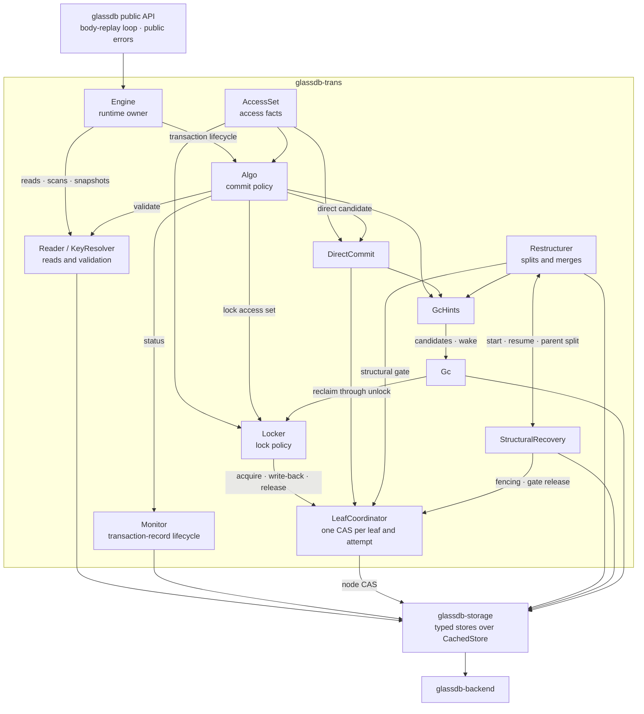
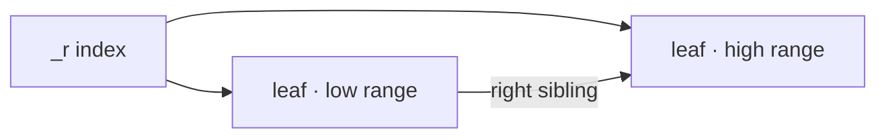
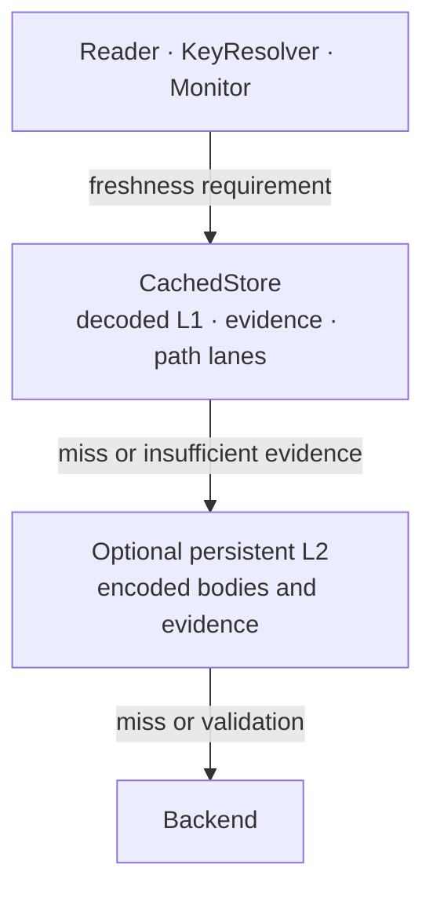

# Architecture

This document records the structure of GlassDB and the constraints that the
code cannot state by itself: why a boundary exists, which invariants must hold,
and which rules keep the protocol correct. Interfaces, parameters, and module
layouts are in the code. The [ADRs](adr/) record each decision,
[CONTEXT.md](../CONTEXT.md) defines the vocabulary, and the
[README](../README.md) covers usage and benchmarks.

## Design goals and trade-offs

GlassDB is a client-side Rust library that stores a transactional key-value
database in object storage. It has these hard constraints:

- **No server.** Database instances are stateless and never talk to each other.
  All coordination happens through object storage, so processes can scale to
  zero and back without coordination.
- **Object storage is the only dependency.** The backend must give linearizable
  single-object operations and conditional mutations. GCS and S3 do.
- **Strict serializability by default.** Transactions behave as if they run one
  at a time, in an order consistent with real time. Stale reads are available
  only when the caller asks for them.
- **Optimistic concurrency.** GlassDB assumes that conflicts are rare and that
  the cache is current. It uses a slower algorithm only when it proves that the
  fast one cannot work.

The trade-offs follow from object storage, where one operation takes 50–150 ms
but the service scales almost without limit:

- Correct and slow is better than fast and wrong when transactions race.
- Throughput is more important than latency. Independent backend calls must run
  in parallel.
- GlassDB expects values between 1 KB and 1 MB.
- Background work must not cost anything that the workload does not need.

[docs/principles.md](principles.md) lists the complete principles.

```
┌─────────────┐  ┌─────────────┐  ┌─────────────┐
│  Process A  │  │  Process B  │  │  Process C  │
│  App code   │  │  App code   │  │  App code   │
│  GlassDB    │  │  GlassDB    │  │  GlassDB    │
└──────┬──────┘  └──────┬──────┘  └──────┬──────┘
       └────────────────┼────────────────┘
                        ▼
              ┌───────────────────┐
              │  Object storage   │
              └───────────────────┘
```

## Crates and boundaries

The Cargo dependency graph enforces the layering at compile time. For example,
`glassdb-storage` cannot call into `glassdb-trans`:

```
glassdb-data → glassdb-backend → glassdb-storage → glassdb-trans → glassdb
glassdb-proto ─┘                  ↑                      ↑
glassdb-concurr ──────────────────┴──────────────────────┘
glassdb-backend-s3, glassdb-backend-gcs → glassdb (optional, feature-gated)
```

A `--cfg sim` build adds one edge from `glassdb-data` to the `glassdb-concurr`
runtime, so that identifier and path entropy comes from the deterministic run.
Normal builds do not have that edge. See [testing-dst.md](guides/testing-dst.md).

Only `glassdb` is a public API. The other crates are implementation details.

`glassdb` talks to `glassdb-trans` only through `Engine` and logical access and
result types. No physical node, lock, or store crosses that boundary. The public
crate keeps the metadata bootstrap, operation admission, the body-replay loop,
public errors, and public handles. `Engine` owns the runtime: it opens caches
and stores, builds the complete component graph, and starts the graph only
after construction is complete. It dispatches reads, scans, and collection
snapshots, and it gives the transaction lifecycle to `Algo`.

### Database metadata

The database metadata holds the hard coordination limits and the transaction
timing, because every database instance must agree on them. Creation writes
them with the database ID, and each open loads them before the engine starts. A
concurrent creator uses the metadata that won. Recovery, lease refresh, and GC
use the stored timing. Databases in earlier formats must be recreated
([ADR-072](adr/072-persisted-database-settings.md)).

Soft thresholds, such as the split and underfull thresholds, stay local to each
database instance. A capacity rejection requests a split without regard to
those thresholds.

The key-size limit is also local, so only write admission applies it. Reads,
deletions, and scans ignore it, because a database instance must be able to
access keys that another instance with a different limit created.

A database instance does not limit concurrent transactions or stale reads. It
counts active calls only so that shutdown can reject new calls and wait for the
active ones.

## Transaction engine components


```mermaid
flowchart TD
  API["glassdb public API<br/>body-replay loop · public errors"]

  subgraph TRANS["glassdb-trans"]
    direction TB
    Engine["Engine<br/>runtime owner"]
    Accesses["AccessSet<br/>access facts"]
    Algo["Algo<br/>commit policy"]
    Reader["Reader / KeyResolver<br/>reads and validation"]
    Locker["Locker<br/>lock policy"]
    Direct["DirectCommit"]
    Monitor["Monitor<br/>transaction-record lifecycle"]
    Hints["GcHints"]
    Restructurer["Restructurer<br/>splits and merges"]
    Recovery["StructuralRecovery"]
    Coord["LeafCoordinator<br/>one CAS per leaf and attempt"]
    Gc["Gc"]

    Engine -->|"transaction lifecycle"| Algo
    Engine -->|"reads · scans · snapshots"| Reader
    Accesses --> Algo
    Accesses --> Locker
    Accesses --> Direct
    Algo -->|"validate"| Reader
    Algo -->|"lock access set"| Locker
    Algo -->|"status"| Monitor
    Algo -->|"direct candidate"| Direct
    Algo --> Hints
    Direct --> Hints
    Restructurer --> Hints
    Hints -->|"candidates · wake"| Gc
    Restructurer <-->|"start · resume · parent split"| Recovery
    Locker -->|"acquire · write-back · release"| Coord
    Direct --> Coord
    Restructurer -->|"structural gate"| Coord
    Recovery -->|"fencing · gate release"| Coord
    Gc -->|"reclaim through unlock"| Locker
  end

  Stores["glassdb-storage<br/>typed stores over CachedStore"]
  Backend["glassdb-backend"]

  API --> Engine
  Reader --> Stores
  Monitor --> Stores
  Coord -->|"node CAS"| Stores
  Restructurer --> Stores
  Recovery --> Stores
  Gc --> Stores
  Stores --> Backend
```

`Engine` also owns and wires `Locker`, `Monitor`, `Restructurer`,
`LeafCoordinator`, and `Gc`. The diagram leaves out those edges.

### Separate policy from mechanism

The central split is between policy, which decides what must happen, and
mechanism, which does it. The table gives each component's job and what it must
not depend on. These limits keep a change to one policy from spreading.

| Component | Decides | Must not know |
| --- | --- | --- |
| `glassdb` (`tx_impl`) | admission, body execution, body replay, public handles and errors | stores, locks, nodes, transaction records, identity renewal |
| `Engine` | runtime construction, lifetime, shutdown order, read entry points | transaction bodies, body-replay policy |
| `AccessSet` | normalization, deterministic order, merged point facts, direct-commit shape | routing, locking, I/O, commit policy |
| `Algo` | identity lifecycle, direct or locked commit, commit orchestration, locked validation, conflict policy | leaf routing, CAS details, caching, GC execution |
| `DirectCommit` | direct-commit eligibility, publication, recovery classification | transaction records, range validation, waiting on or wounding holders |
| `CollectionCommit` | collection replay state, recovery manifest fields, drop intents, cleanup | key locking, the commit decision |
| `Locker::keys` | key-to-leaf grouping, parallel and serial acquisition, hold-and-wait | collection directory semantics |
| `Locker::collections` | directory locks, topology participant release | key routing, B-link topology |
| `CollectionStateResolver` | collection record loads, foreign holder reconciliation | key routing, B-link topology, catalog semantics |
| `CollectionCatalog` | logical snapshots, read-your-writes, precondition checks | locking, CAS, wound-wait |
| `LeafCoordinator` | batching, mutation plans, admission, one CAS per attempt, in-doubt recovery | operation-specific results, commit orchestration, GC selection |
| `Restructurer` | split and merge scheduling, planning, and node writes | durable intent phases, recovery classification |
| `StructuralRecovery` | structural intent lifecycle, fencing, orphan cleanup | split and merge planning, maintenance causes |
| `Monitor` | transaction status, wounds, lease refresh, waits | leaves |
| `Gc` | GC queues, GC checks, safety horizon, reclamation | commit policy, structural recovery |

These rules are not visible from any one module:

- **Every leaf mutation goes through one `LeafCoordinator`.** Lock acquisition,
  direct commit, write-back, release, GC reclamation, and structural gates all
  use it. It loads the leaf once per attempt and persists all changes with one
  CAS ([ADR-028](adr/028-shard-mutation-coordinator.md),
  [ADR-029](adr/029-gc-through-shard-coordinator.md)). The coordinator is a
  transaction-aware mutation engine: it owns identity, ordering, admission, and
  recovery across a round of different operations. `Algo`, the `Locker`, and
  the `Restructurer` supply each operation's target, member policy, and typed
  result. The coordinator reads a member's outcome only for admission,
  exclusion, and delivery, never for operation-specific policy.
- **`Algo` never routes a key or does a CAS.** It works with logical keys,
  observed writers, and staged writes.
- **GlassDB does not schedule backend calls across transactions.** Each
  transaction runs its independent point work with one bounded parallelism
  value. Backend adapters own queues, connections, retries, and throttling
  ([ADR-064](adr/064-bounded-parallel-point-leaf-work.md)).
- **Only `Algo` changes from parallel to serial acquisition.** It ends the old
  identity and waits for a durable abort-side status before it renews the
  identity. The new identity keeps its priority and cannot publish until the
  old identity has a final status. Point and range work continue without a body
  replay. Collection changes need a body replay, because their physical
  resources belonged to the old identity
  ([ADR-065](adr/065-renewed-transaction-identity-on-serial-fallback.md)).

### Leaf coordination order

A coordinator round evaluates its members in priority order: the oldest
wound-wait priority first, and transaction identity bytes as a tie-break. The
tie-break only makes a round deterministic. It does not change the persistent
wound-wait priority. A later member cannot wound an earlier one.

A member's changes pass admission all together or not at all. A later member
policy sees the changes admitted from earlier members. Evaluation can do
protocol work, such as a wound, so building a mutation plan is not a pure
computation. A plan with no staged changes keeps the loaded observation and
does no CAS. After contention or an in-doubt result, the coordinator loads the
leaf again and builds a new plan, and each member keeps its unresolved in-doubt
state. A member receives an outcome with staged changes only after the CAS succeeds.
A member that is skipped because an earlier member already staged its change
also waits for that CAS.

### Keep physical state out of the lock boundary

The calls between `Algo` and `Locker` carry only logical data:

- **Down:** the key view gets the access set, the serial flag, and the
  validation bound. The collection view gets directory reads and binding
  changes, and derives a stable lock order.
- **Up:** the result is a locked-transaction handle or a conflict. A normal
  conflict causes a body replay under the same identity, and the transaction
  keeps the leaf locks that it has. After sustained parallel conflict, `Algo`
  renews the identity and changes to serial acquisition.

Validation is not part of this boundary. After locking, `Algo` resolves the
effective writer of each read again and compares it with what the body saw. It
uses the same routine as optimistic validation, so validation logic exists in
one place only. The deadlock timeout, the serial fallback, and backoff are also
policy and stay in `Algo`. The locker has only an internal CAS retry budget, and
it reports sustained contention as a conflict instead of retrying without limit.

## Backend contract

The `Backend` trait has six conditional-only methods, and a caller can cancel
each one by dropping its future. The methods are: read,
revision-conditional read, conditional replace, create-if-absent write,
conditional delete, and paginated prefix listing
([ADR-042](adr/042-conditional-only-backend-mutations.md)). S3 and GCS provide
each one natively. All coordination state is in object content. There are no
tags, metadata, writer IDs, or unconditional mutations.

Correctness depends on these properties:

- **Linearizability.** Single-object reads and conditional mutations are
  linearizable. A read after a definitive completion sees that result or a
  later one. An eventually consistent backend is not supported.
- **Opaque revisions.** A revision identifies content for conditional
  operations. GCS uses the object generation and S3 uses the ETag. Callers only
  pass it back. A revision-conditional read returns `Precondition`
  without the body when the revision still matches, so a hot, unchanged object
  costs no body transfer ([ADR-023](adr/023-slimmed-backend-trait.md)).
- **`Unavailable` is not an answer.** For a mutation, `Unavailable` means that
  the outcome is in doubt, so a blind retry is not safe
  ([ADR-009](adr/009-in-doubt-conditional-writes.md)). For a read or a list, a
  retry is safe. The reader retries in place and reports a sustained outage as
  an unavailability error ([ADR-015](adr/015-read-unavailability.md)). Only a
  definitive response creates an ordering edge. Provider retries stay inside one
  backend call, so they do not create ordering edges.
- **A conditional delete of a missing object succeeds.**
- **Listing is not a snapshot.** A cursor binds a provider token to its prefix.
  Only a page without a next cursor ends a traversal. A rejected token lets the
  caller restart the prefix
  ([ADR-035](adr/035-paginated-listing-and-sharded-transaction-logs.md)).

The in-memory backend and the middleware wrappers are for tests and debugging.
The PR benchmarks add modeled provider latency and throttling to the in-memory
backend. See [the benchmark conditions](../crates/glassdb/benches/README.md).

## Transaction algorithm

GlassDB gets strict serializability from two properties. Object storage gives
linearizable single-object operations. A modified strict two-phase locking
protocol gives serializable isolation, because every lock stays held until
after commit. The
[blog post](https://blog.mbrt.dev/posts/transactional-object-storage) compares
this with other databases.

### Transaction lifecycle

```
Begin ─► Execute ─► Validate ──no conflict──► Commit ─► Write-back (async)
            ▲           │
            └─ replay ◄─┘ invalidated read
```

1. **Execute.** The body reads through the cache and stages writes in memory.
   It holds no locks, so transactions on different keys never wait for each
   other.
2. **Validate.** The transaction locks the access set and checks that every
   observed writer is still the effective writer. If a read is invalidated, the
   transaction does a locked replay.
3. **Commit.** The transaction record becomes committed. That CAS is the commit
   point.
4. **Write-back.** The transaction publishes new values, releases locks, and
   reports a GC hint. Write-back can be asynchronous, because the transaction
   record is the source of truth. If the owner crashes, another transaction can
   help forward or read the values from the record.

`Database::tx` takes the body by value and owns the body-replay loop, so a
conflict only causes a body replay. Dropping the transaction future at any
point is equal to a crash. Recovery handles the state that it leaves.

### Locks live in leaf content

Each leaf holds one entry per key. An entry records the lock type, the holders,
and the current state of the key.

| Requested | None | Read | Write | Create |
| --- | :-: | :-: | :-: | :-: |
| Read | ✓ | ✓ | wait | wait |
| Write | ✓ | upgrade if sole holder | wait | wait |
| Create | ✓ | upgrade if sole holder | wait | wait |

A put to a key outside the key membership takes a create lock, so that two
transactions cannot create the same key.

Locking is a CAS of the leaf object. Keys that route to the same leaf share one
read and one CAS ([ADR-017](adr/017-shard-object.md),
[ADR-020](adr/020-commit-write-back-protocol.md)). Transactions that contend
for the same leaf batch into one coordinator round instead of racing
([ADR-025](adr/025-dedup-shard-lock-acquisition.md),
[ADR-026](adr/026-dedup-shard-release-write-back.md)).

The current state is absent, an external value, an inline value, or a
tombstone ([ADR-051](adr/051-inline-latest-values.md)). A read of an inline value or a
tombstone needs no transaction record read. Only a direct commit creates an
inline value, because there the leaf is the only durable copy of the value.
Locked write-back and help-forward publish external values. They never demote
an existing inline value to an external value of the same writer, because that
writer can have no transaction record ([ADR-054](adr/054-reserve-inline-publication-for-logless-commits.md)).

A read of a key whose current state is absent records the membership generation
of its leaf. If the physical leaf changes, validation requires that the key is
still absent and that the generation is the same. A tombstone read records its
writer instead. A structural change never returns a leaf to an
earlier generation. The restructurer removes tombstones without holders under
its structural gate, before its final split decision. If that removes the
pressure, it cancels the split
([ADR-062](adr/062-splitter-driven-tombstone-reclamation.md)).

A create that reaches the leaf content limit releases its partial locks and
retries, so the restructurer can make room. The first capacity result starts one
bounded wait. Leaf revisions, reroutes, and other full leaves do not reset it.
Without that bound, a split that cannot happen or continuous churn would make
the foreground wait forever.

### Transaction records

Each transaction identity has one record at a path that comes from the
identity:

```
<db-prefix>/_t/<first-encoded-symbol>/<second-encoded-symbol>/<base64-encoded-tx-id>
```

The identity has 16 bytes: an 8-byte random prefix, then an 8-byte big-endian
nanosecond timestamp. The timestamp gives the wound-wait priority. The random
bytes come first so that record paths spread across object storage partitions,
instead of putting sequential commits in one hot partition. The first two
encoded symbols are separate path segments, so a GC scan can list the root, one
of 64 prefixes, or one of 4,096 prefixes
([ADR-070](adr/070-demand-driven-garbage-collection.md)). There is no migration
from older layouts, and older binaries must not use the same database.

The record holds the transaction status, the lease timestamp, the recovery
manifest, and, after commit, the committed values
([ADR-019](adr/019-unified-transaction-object.md)). Lock state is in the leaves,
not in the record. The record has two jobs:

1. **Commit point.** A locked commit takes effect if and only if its record is
   committed. One object write makes all its writes durable.
2. **Recovery arbiter.** Other transactions read the record to find out whether
   a holder is still active. They wound a holder whose lease expired with a CAS
   of its record.

`Wounded` has the same meaning as aborted for readers, but GC cannot delete it
until the owner acknowledges it as `Aborted`
([ADR-059](adr/059-pin-foreign-wounds-until-owner-retirement.md)).

### Locked commit

1. **Lock in parallel.** The transaction locks all read and written keys, with
   a limit on incomplete leaf operations. Wound-wait resolves conflicts. A
   deadlock timeout changes to serial acquisition only when contention stops
   progress.
2. **Validate.** Optimistic validation first checks the retained leaf
   observations, and resolves the logical point reads only if a physical state
   changed. Locked validation always resolves the logical reads, and treats the
   transaction's own exclusive lock as protection for the previous state. An
   invalidated read causes a locked replay.
3. **Commit.** The transaction record becomes committed.
4. **Write-back.** Write-back uses the same bounded parallelism over routed leaf
   groups. If a live structural holder is present, write-back leaves the work to
   lazy recovery.

### Fast paths

**Read-only transactions** use optimistic validation. After the last read, the
transaction checks that every writer is still current and that no read key has
a write lock. If the check passes, the transaction returns with no locks and no
writes. Each key costs one leaf read, plus one record read if the value is not
inline. If the check fails, the transaction uses the locked commit one time.

**Direct commit** applies when all point reads and point writes of a transaction
route to one leaf. One leaf CAS validates every read and publishes every output,
with no lock, transaction record, or write-back
([ADR-061](adr/061-atomic-logless-single-leaf-commits.md)). Every put becomes an
inline value and every delete a tombstone. All values must fit the inline
limits and the result must fit the leaf. Range scans, collection reads and
changes, cross-leaf access, structural gates, drop intents, and live or unknown holders
use the locked commit. A direct commit never waits for or wounds a holder. A
failed multi-key direct commit does not request a split, because a split can
make the transaction ineligible. A failed single-key direct commit still reports
inline pressure.

GlassDB classifies a direct commit that does not land as a whole
([ADR-053](adr/053-replay-definitive-logless-rmw-losses.md)). If the loss is
certain and the transaction read data, the body replays under the same
identity. The identity is not engaged yet, so it has no durable effects to
settle. A blind write, or a transaction that needs coordination, uses the
locked commit. In one coordinator round, an earlier direct member reserves all
its output keys, so a later member that overlaps is excluded. Direct members
that do not overlap share the same CAS.

Recovery of an in-doubt direct commit uses only local information. Any inline
value or tombstone with this identity proves that the whole commit landed. If
there is no marker, unchanged previous states prove that it did not land, but
only if at least one output could not return to its previous state through
tombstone reclamation. Otherwise, the transaction can report an in-doubt error.
If the reads are still valid, the transaction can try a direct commit again. An
invalidated read causes a body replay. If pruning a holder with a final status
changed the temporary generation and caused validation to
fail, the transaction uses the locked commit. The locked commit makes the
pruning durable, and a body replay against a change that was never stored would
fail again. Cancellation before dispatch leaves no state. Cancellation after
dispatch is equal to a crash.

**Locked replay** keeps the key locks and membership locks of the transaction.
Other transactions cannot write those keys, so sustained writes cannot cause
body replays without limit.

### Transaction interruption

Snapshot transparency applies to commit outcomes and validated error outcomes.
A panic is not an error outcome. Its payload propagates without validation or
body replay, even when the body saw an inconsistent snapshot.

An active identity and its retirement guard are one resource. The guard is
disarmed only after finalization succeeds. On cancellation or unwinding, the
retirement handoff moves the identity to the engine before control leaves the
owner. The engine then settles or pins the identity in background work. Locks
and prepared collection objects stay recoverable through the recovery manifest.
Helpers and GC release them later. A process abort skips unwinding and uses
normal crash recovery.

### Wound-wait prevents deadlocks

When a lock request conflicts with a holder
([ADR-002](adr/002-wound-wait-locking.md),
[ADR-024](adr/024-hold-and-wait-conflict-resolution.md)):

- An **older** requester wounds the holder. The holder's record gets a final
  status before the requester takes the lock. A foreign or in-doubt wound
  writes a pinned `Wounded`. A database instance that can prove its own victim
  retired writes `Aborted`.
- A **younger** requester waits and keeps the locks that it has
  (hold-and-wait).

An older transaction never waits for a younger one, so no wait cycle can form.
A wounded transaction renews its identity and replays its body. The new
identity keeps the original priority, so the transaction does not starve.

Serial acquisition is a safety net. If the deadlock timeout fires, because of
sustained contention or two transactions with equal priority, the transaction
locks its leaves one at a time in ascending object path order. A total order cannot deadlock.

Priority comes only from the timestamp, never from the random prefix. Identity
renewal changes the prefix. If priority used the prefix, two transactions with
the same timestamp could change order at each renewal and livelock.

### Crash recovery

The `Monitor` handles a crash or a dropped transaction future:

1. **Lease.** While a transaction holds locks, it refreshes its record at half
   the pending-transaction timeout. Other transactions consider the lease
   expired when the timestamp is older than the timeout plus a bounded clock
   skew.
2. **Wound.** A competitor changes the expired record to `Wounded` with a CAS.
   If the record does not exist yet, because the owner writes it lazily, the
   competitor creates it. If the CAS loses to a refresh or a commit, the
   competitor waits longer. CAS makes sure that only one of a wound and a
   commit wins.
3. **Owner acknowledgement.** An owner that returns and proves that no operation
   can still publish changes `Wounded` to `Aborted`. Only then does normal GC
   retention apply. Local pending state cannot rule out a wound from another
   instance, so a confirmed wound always causes identity renewal and a body
   replay.
4. **Retirement handoff.** Cancellation, unwinding, and failed finalization keep
   the retirement guard armed, and the handoff gives the identity to waited
   recovery before control leaves the owner. A failed retirement is only a
   diagnostic. Wounds, leases, help-forward, and GC still recover the state.

## Collections

`CollectionPath` holds raw names. Resolution walks the directory in each parent
collection record and returns a collection bound to an opaque collection ID.
Point operations route by ID and do not check the ancestors again.

Every collection has an `_i` collection record with a bounded, sorted directory
of child names to child IDs, and an `_r` tree root with only node state. The
entry in the parent directory decides whether a collection exists, not the
presence of its objects. The root collection is permanent, holds keys, and has
a reserved ID outside the generated range.

A create prepares an unreachable record and root at a fresh ID, then publishes
`name → ID` through the locked commit. Open, create, drop, and child listing all
use the transaction machinery, and `Transaction` overlays their changes for
read-your-writes. `Algo` runs collection and key locking around the same
validation barrier and the same commit point.

### Drops

A drop freezes the topology of the target collection and installs its identity
as a drop intent on every root, index node, and leaf. Every earlier participant
must settle before the drop enumerates nodes. A point operation checks only the
node that it already reads. An aborted intent can be removed, a pending intent
takes part in wound-wait, and a committed intent reports a stale collection
handle.

A later drop replaces the drop intent of an aborted or wounded owner in the same
CAS that installs its own fence. A final status does not clear the stored
intent, and reading again does not make progress. Other pending holders must be
resolved before that CAS. A committed drop from another transaction rejects the
new drop.

Cleanup after an aborted drop needs separate evidence of completion for the
root, each standalone node, and the collection record. It must check the
topology freeze even if the record lists no directory locks, because a record
can list a drop before it lists the directory locks.

### Identities own collection resources

A transaction identity owns its collection ID reservations and prepared
objects. A body replay reuses them. An identity renewal replaces them, because
GC can reclaim resources of the retired identity. For that reason the engine
allocates the identity before the first body execution. The allocation is local.
The transaction record and the locks come only when the commit needs them.

`Engine` gives the same `CollectionStateResolver` to `CollectionCatalog` and to
`Locker`. The catalog can then resolve collection state without access to the
locker, and neither `NodeStore` nor the catalog coordinates collection records.

## Collection trees and structural changes

A small collection has one leaf, `_r`. When `_r` splits, it becomes an index
node over leaves with contiguous key ranges. Each level has right-sibling links,
so a traversal from stale cached index nodes can move right after a split and
still be correct.


```mermaid
flowchart LR
  Root["_r index"] --> Left["leaf · low range"]
  Root --> Right["leaf · high range"]
  Left -->|right sibling| Right
```

An underfull node merges into its right sibling
([ADR-073](adr/073-merge-nodes-into-right-sibling.md)). The drained node stays
until its collection is dropped, so a stale route passes through its right link.
Each node stores its low key, so a route that finds an old cached copy of a
merge target reads it again. Until the drain lands, a merge reservation on the
target keeps its copies of the drained entries, and only the merge intent can
remove the reservation. `_r` never merges, so the tree height never decreases.

`TreeRouter` has the routing logic. Key resolution, the key-lock view, GC, and
the `Restructurer` each have their own handle for their own workflow. The
handles share one decoded cache, and none of them has structural intent access
or its own topology state.

### Restructurer schedules, StructuralRecovery owns durability

`StructuralRecovery` owns each structural intent from its first write to its
deletion or recovery. It classifies phases, fences source writers, checks
reachability, removes unreachable nodes, and settles topology participants. The
`Restructurer` does not read durable phases. Toward recovery, it only runs a
requested recursive parent split and returns the result.

Splits and merges share one lifecycle and one parent reconciliation step. The
`Restructurer` gives each candidate to the split module or the merge module.

Committed leaf writes, parent reconciliation, and capacity rejections queue
candidates. With the default avoidable time topology policy, a rule decides the
other leaf splits and merges once per window
([ADR-074](adr/074-avoidable-time-drives-splits-and-merges.md),
[ADR-075](adr/075-avoidable-time-is-the-default-topology-policy.md)). With the
size causes policy, the underfull threshold and inline pressure decide. A new
candidate wakes the restructurer after a short delay, so that one sweep takes a
burst of writes. A deferred candidate waits for the next sweep, which comes at
most a fixed interval later, so a busy node cannot cause a tight retry loop. A
merge defers while a live transaction holds a lock on its source or target.

### Fence on the recorded revision

Recovery fences a source writer against the source revision that the Ready
transition of the intent recorded, not against the current structural gate. A
worker publishes its split shrink or merge drain with one CAS that expects that
revision. The revision alone tells whether the worker can still land, and a
later structural change of the same source cannot protect an abandoned intent.
Each gate installation increases the membership generation, so the recorded
revision cannot come back. Structural recovery runs on its own schedule in its
own namespace, and does not use the GC candidate queue.

## Storage, caching, and consistency

The decoded object cache is the coordination boundary for point operations, not
only an optimization. It combines the typed cache of
[ADR-036](adr/036-decoded-object-cache-with-bounded-freshness.md) with the causal
order of [ADR-043](adr/043-causally-coordinated-backend-operations.md). The
[cache guide](guides/caching.md) gives the full model and why it is sound. The
[storage evidence rules](guides/storage-consistency.md) give the type rules.


```mermaid
flowchart TD
  Access["Reader · KeyResolver · Monitor"]
  L1["CachedStore<br/>decoded L1 · evidence · path lanes"]
  L2["Optional persistent L2<br/>encoded bodies and evidence"]
  Backend["Backend"]

  Access -->|"freshness requirement"| L1
  L1 -->|"miss or insufficient evidence"| L2
  L2 -->|"miss or validation"| Backend
```

All typed objects share one byte-weighted LRU with one budget. Each physical
path has one decoded type. Values are not cached separately: the reader gets
them from the inline bytes of the leaf or from the decoded transaction record
of the writer. Eviction does not revoke observations that readers or
transactions already hold.

The optional L2 stores encoded bodies, revisions, and currentness points on
disk. One bounded worker does all its file I/O instead of Tokio's blocking pool,
so under overload GlassDB skips L2 instead of queuing blocking tasks without
limit. Open and shutdown have deadlines and fail open.

### Evidence rules

A cache entry is always usable knowledge: a decoded value with its revision and
evidence, or a definitive absence. Uncertainty is the absence of an entry, so no
lookup can use it by accident.

A sequence point is an ordered event that one open database allocates just
before a backend call. A definitive result with that point proves that its state
was current at some time no earlier than the point. Sequence points are local to
one open database. L2 persists them only to continue the timeline at the next
open of the same database.

A caller states the evidence that it needs as a freshness requirement:

| Requirement | Accepts |
| --- | --- |
| `ANY` | any usable entry |
| `within(timeline, age)` | evidence newer than an approximate age |
| `after(barrier)` | evidence that reaches a currentness barrier |

An `ANY` decision needs a separate proof, such as later validation or a
conditional mutation
([cache guide](guides/caching.md#decisions-from-any-reads)). A currentness
barrier is captured after the prerequisite work and before the operations that
depend on it. Transaction validation captures one after the body and before the
lock CASes. GC and structural recovery capture their own. Higher layers can
hold and compare barriers and requirements, but cannot create evidence
([currentness barriers](guides/caching.md#currentness-barriers)).

A CAS receipt proves that one conditional change took effect. It does not prove
that the installed state is still current, and a later read cannot renew its
proof. In a coordinator round, only a member whose changes were in the CAS gets
the receipt. A skipped member keeps the loaded observation
([CAS receipts](guides/caching.md#cas-receipts),
[coordinator rules](guides/caching.md#coordinator-mutation-evidence)).

### One backend call per path at a time

In one open database, `CachedStore` serializes backend point calls on the same
path:

```text
check cache → acquire the path lane → check cache again → allocate invocation point
→ call backend → reconcile cache and observations → release lane → complete
```

The second check stops a waiter from calling the backend when an earlier call
made it unnecessary. The invocation point is allocated inside the lane, so local
order and backend order agree. Reconciliation happens before the lane is
released, so no caller sees a completed call whose result is not in the cache.
Different paths run concurrently, and code must never hold two path lanes at the
same time. Compatible reads can share one backend read when its invocation point
satisfies their requirements.

An `ANY` cache hit does not take the lane. It can return an older state while a
mutation on the same path runs, but never a state already marked obsolete or in
doubt.

Listing is not coordinated per path. Each page gets its own invocation point.
Database metadata uses raw backend calls, because it is created or checked once
before concurrent access starts.

Reconciliation never guesses. A definitive result installs the exact state. A
rejected mutation invalidates only the matching knowledge. An in-doubt mutation
removes all knowledge for the path. If a caller cancels a mutation after
dispatch, a guard invalidates the path before it releases the lane, because the
mutation can still take effect. A cancelled read needs no invalidation.

### Invariants

The cache and the coordinator depend on, and keep, these properties:

1. Backend single-object reads and conditional mutations are linearizable. A
   read after a definitive mutation sees that mutation or a later state.
2. A conditional mutation stays safe if its predicate becomes true again,
   because revisions can repeat (ABA). Create-if-absent is only for permanent
   idempotent paths, or fresh identity paths whose existence alone cannot
   publish newer live state.
3. In one open database, no two backend point calls on the same path overlap.
   The only exception is a cancelled mutation that can still run remotely.
4. A call on a path starts only after the earlier definitive result on that path
   is reconciled. Different paths do not wait for each other.
5. A cache entry that a lookup can find is always usable. A clean conflict
   cannot overwrite newer knowledge. An in-doubt or cancelled mutation leaves no
   knowledge for its path.
6. Evidence never goes past the invocation point that created it. Evidence for
   an unchanged state only increases.
7. A successful mutation publishes the exact installed state, so its caller can
   use the result without a read to verify it.
8. Path lanes and sequence points are local to one open database. Other opens
   and external writers are ordered only by backend linearizability and
   revisions.

A transaction body can use cached state freely, because validation checks every
dependency at the validation barrier. Committed and aborted statuses never
change, so the cache can keep them forever. `Wounded` can still change to
`Aborted`, so it is checked again. A cached committed status can outlive the
cached record body. If the body is missing, the module that owns the referring
observation reloads at a newer bound and retries. A missing historical body
never becomes a missing key or a missing collection.

## Object layout

| Marker | Object | Path |
| --- | --- | --- |
| `_c` | collection namespace | `mydb/_c/<collection-id>` |
| `_i` | collection record | `mydb/_c/<collection-id>/_i` |
| `_r` | tree root | `mydb/_c/<collection-id>/_r` |
| `_n` | standalone node | `mydb/_c/<collection-id>/_n/<node-id>` |
| `_t` | transaction record | `mydb/_t/<a>/<b>/<transaction-identity>` |
| `_s` | structural intent | `mydb/_s/<participant-id>/<intent-id>` |

Collection IDs, node IDs, transaction identities, and structural intent IDs have
16 bytes. Paths encode them with an order-preserving base64 alphabet, so paths
sort the same as the raw bytes. Keys stay as raw bytes inside leaves.
Transaction records and structural intents store raw IDs and keys, not paths, so
a database stays valid after it moves to a different prefix.

A writer and a revision are different things
([ADR-023](adr/023-slimmed-backend-trait.md)). The writer is the transaction
identity that committed a value. For an external value, it tells the reader
which transaction record holds the value. The revision identifies the content of an object for
conditional mutations and cache checks. Validation compares writers. The lock
CAS uses revisions.

## Garbage collection

A transaction record is live while a node or collection record refers to its
identity. GC is therefore a reachability problem, not a timer. A direct commit
names writers that never had a record, and that is not a dangling reference:
only existing records are candidates. GC is a candidate-driven reverse
mark-sweep ([ADR-022](adr/022-garbage-collection-mark-sweep.md)):

- **GC check from the candidate.** A forward mark would read the whole database on each
  cycle. Instead, each record lists its own claims in its recovery manifest, so
  a GC check reads only the few nodes and records that the candidate names.
  Terminal leaves must meet the GC freshness bound. Collection and node IDs are
  never reused, objects are created before a commit or link publishes them, and
  published nodes stay until the collection is reclaimed. For those reasons a
  cached absence cannot hide a later live route.
- **GC hints.** `Algo`, `DirectCommit`, and `Restructurer` report candidates
  through `GcHints`. A report never waits for queue space, the backend, or GC. A
  full queue drops the report and counts the loss. A hint wakes GC but does not
  start a LIST. GC scans find the records that dropped hints miss.
- **Local state.** Each opened `Database` has its own GC state, and clones share
  it. Memory, admission, and concurrency are all bounded. GC scans have their
  own capacity, so they can find work after hints are dropped.
- **Safety horizon.** GC keeps a candidate that is not `Wounded` for the lease
  plus the allowed clock skew. The GC check is not atomic, so it can race a
  lock that a live transaction took but did not publish yet. GC changes a dead
  `Pending` record to `Wounded`, so its death survives an owner suspension of
  any length. GC can then reclaim the effects of that record, but cannot delete
  it until the owner changes it to `Aborted`
  ([ADR-059](adr/059-pin-foreign-wounds-until-owner-retirement.md)).
- **Reclamation through the coordinator.** GC releases locks through the unlock
  methods of `Locker`, so its changes batch with live traffic in the same
  coordinator round ([ADR-029](adr/029-gc-through-shard-coordinator.md)). Entry
  references, membership locks, directory holders, and topology participants
  each need their own completion evidence. GC deletes only the exact revision
  that it checked. It reclaims a dropped collection one node page at a time and
  removes the root and the collection record last.
- **Writer independence.** GC backlog never blocks transaction admission or completion, adds requests
  to the commit path, or runs inside transaction bodies. At the GC limit,
  garbage only stays longer. Sustained overload can delay reclamation without
  limit. Shared CPU, backend requests, and coordinator rounds can still affect
  transaction latency.

GC deletion counts are approximate: a delete of a missing object succeeds, so
two database instances can count the same deletion.

### Adaptive GC scans

GC scans are a backup for dropped hints. Each scan turn does at most one LIST.
Database instances scan shuffled prefixes independently, with no reservations,
leases, or coordination writes. LIST is not a snapshot, so scans must repeat.

Each instance scans at one depth: the transaction root, 64 prefixes, or 4,096
prefixes. A traversal that still has a cursor after enough pages makes the depth
narrower. To make it broader, the instance counts records in random prefixes and
picks the broadest depth that its page budget per prefix can cover. A depth
change resets the samples and the schedule, but running traversals keep their
prefixes. A prefix can have only one active traversal, which limits the number
of held cursors.

The delay between turns follows the recent useful progress of scan-origin
checks, with random variation and a cap tied to the pending-transaction timeout.
Errors use separate retries and never count as idle turns. These limits are
initial values. Production workloads must guide later tuning.

GC runs only while a `Database` handle is open. To add GC capacity, open a
database instance that submits no transactions. All local GC state is
disposable. Reclamation needs running instances, a working backend, and enough
GC capacity.
