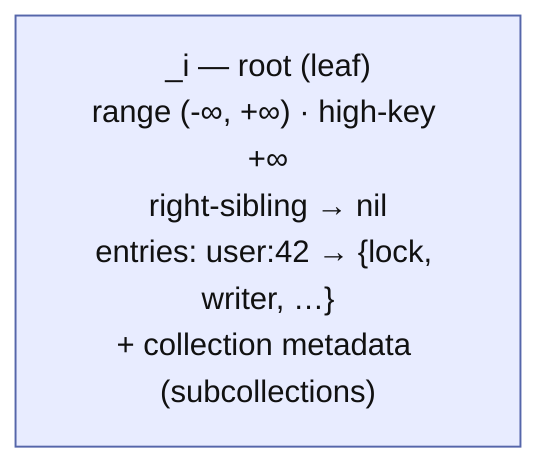
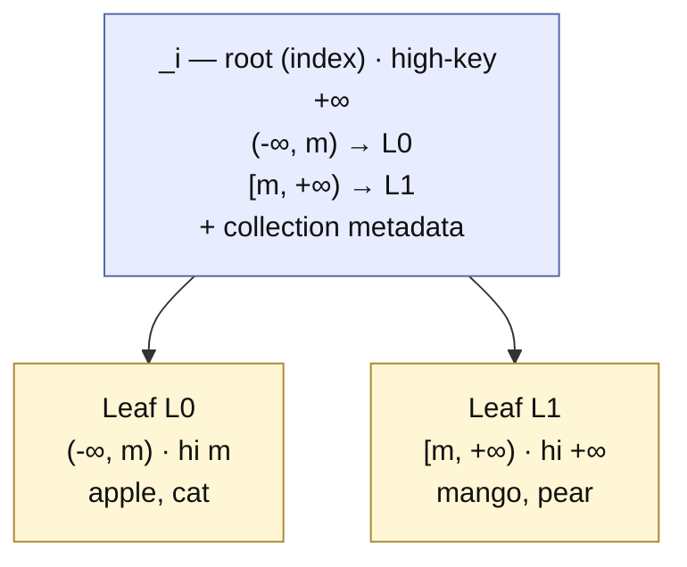
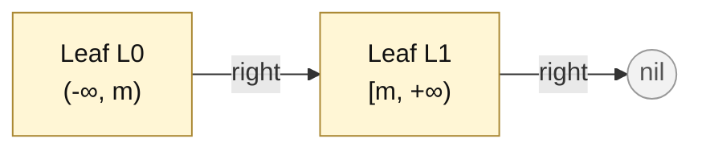
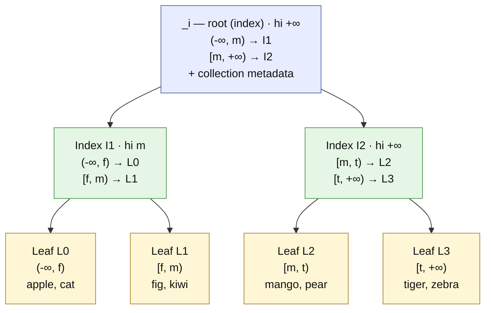
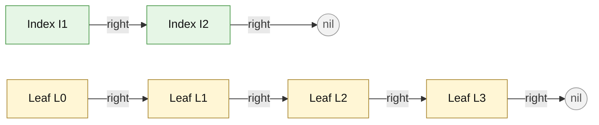

# Dynamic range sharding (design overview)

## Status

**Proposed.** This is the design overview and decision index for replacing the
fixed compile-time hash sharding of collection metadata with a **dynamic,
order-preserving, range-partitioned** coordination directory. The umbrella
decision is [ADR-031](../adr/031-dynamic-range-sharding.md). This document is the
living companion to that (frozen) ADR; it captures the shape, the rationale, the
invariants, and the open questions.

It builds on the object-storage-native layout of
[`object-storage-native.md`](object-storage-native.md): the shard *entry* model, transaction
objects, commit/write-back, wound-wait/leases, GC, and the shard-mutation
coordinator all carry over. Only the **key→shard mapping** and the **directory
structure** change.

## Why

Fixed hash sharding (`C = 1024`, `shard_index(key) = fnv1a(key) & (C-1)`,
ADR-016/017) has four limitations:

1. **Capacity** — a collection is capped at `C × keys-per-shard` (~256k keys).
2. **Small-collection waste** — a tiny collection still spreads across the hash
   space and cannot adapt to its actual size.
3. **No sorted listing** — hashing destroys key order, so ordered enumeration and
   range/prefix scans are impossible.
4. **Coarse membership** — one collection-root lock serializes all create/delete.

Efficient **sorted/range listing** (2 above elevated to a requirement) is
fundamentally incompatible with hashing and forces an **order-preserving**
partition, which — made growable — resolves all four at once.

## Design at a glance

A **B-link tree** of objects per collection (Lehman–Yao), mutated only by content
CAS. Leaves are the shards; interior nodes are the range index.

- **Objects**
  - _Root object_ (`_i`, fixed well-known path): **is** the tree's current root
    node — a leaf while the collection is small, an index node once it grows —
    and also carries the collection metadata (existence + subcollection list).
    There is no separate anchor: the root keeps a fixed address, so height grows
    by **splitting the root in place** and every descent starts at `_i`.
  - _Index node_ (interior, incl. the root at height ≥ 2): ordered separator keys
    → child pointers, a **high-key**, and a **right-sibling** link. Maps a key
    range to its child.
  - _Leaf shard_ (incl. the root at height 1): owns a contiguous key range; holds
    the ADR-017 per-key entries (lock type · `locked_by` · `current_writer` ·
    tombstone) sorted by key; also a **high-key** and **right-sibling** link. The
    CAS unit for its keys.
  - _Transaction object_ (`_t/<txid>`): unchanged (status + values + lease).
- **Ordering** — lexicographic over raw key bytes, matching the order-preserving
  path encoding.
- **Mapping** — descend from the root object `_i`; each node self-describes its
  range (high-key), so descent is **cached and self-correcting**.
- **Reads/writes (hot path)** — descend via cached interior nodes (incl. `_i`) to
  the leaf, read the leaf. If a node's high-key shows the key moved (a split raced
  the cache), **follow the right-sibling link** or re-descend from a refreshed
  `_i`. No central read on a cache hit.
- **Split (grow)** — background; a lock-free half-split driven through the
  shard-mutation coordinator; a root split grows height **in place** at `_i`
  (protocol in [ADR-031](../adr/031-dynamic-range-sharding.md#split-grow-background-and-lock-free)).
- **Merge (shrink)** — deferred; the node format reserves sibling links and range
  bounds so it is addable without a format migration.
- **Membership** — per-leaf: create/delete lock only the target leaf entry;
  range listing OCC-validates covered leaves and follows right-links across
  concurrent splits, escalating to per-leaf read locks under contention.
- **Wound-wait / leases / GC** — unchanged mechanisms at leaf/index granularity;
  GC and recovery re-resolve a key's shard through the *current* topology.

## Tree shape

### Minimal case — a single key (or a small collection)

The whole collection is a **single object**: `_i` is the root *and* the only
leaf. There are no index nodes and no siblings. Reading or writing the key is a
single GET/CAS on `_i`.

As keys are added, `_i` eventually crosses its soft cap. Because the root cannot
move, the **first** split grows height *in place*: two new leaves take the two
halves, and `_i` is rewritten from a leaf into a two-entry index root pointing at
them (height 1 → 2):

The leaves are chained left-to-right by their right-sibling pointers:

### Many keys — a multi-level tree

Splits propagate upward, so the tree gains levels as the collection grows (here
height 3). Only leaves hold key entries; interior nodes map ranges to children.

Each level is a left-to-right linked list via the right-sibling pointers — the
index level and the leaf level shown separately (this is what a sorted/range scan
walks, and what a stale cached lookup follows to self-correct after a split):

Notes:

- **Descent** for `"kiwi"`: root `_i` (`"kiwi" < "m"` → I1) → I1 (`"f" ≤ "kiwi" <
  "m"` → L1) → read L1. On a cache hit only L1 is fetched.
- **Right-links cross parent boundaries** (e.g. I1 → I2): a lookup that lands too
  far left after a concurrent split follows the right-link without going back up
  to the root — the B-link property that keeps the hot path off central nodes.
- **Sorted listing** is the leaf chain `L0 → L1 → L2 → L3`; a range scan enters at
  the range's start leaf and stops when a leaf's low bound passes the range end.
- Only leaves hold key entries (lock/MVCC state); index nodes hold separator keys
  → child pointers. The root is the `_i` object itself — once the tree has grown
  it holds separators (plus the collection metadata), not keys.

## Constituent ADRs

This redesign spans multiple decisions; each significant one is a frozen ADR,
tracked here. The detailed object model, encoding, split protocol (leaf and
in-place root split), membership rules, invariants, and trade-offs live in the
ADR — this overview and the diagrams above are the map into it.

- **[ADR-031](../adr/031-dynamic-range-sharding.md) — Dynamic range-partitioned
  sharding (B-link tree).** *Proposed.* The umbrella decision: B-link object
  model and encoding, cached self-correcting descent, the lock-free leaf split
  and in-place root split, per-range membership and phantom prevention, and what
  it supersedes/reuses.

Planned follow-on ADRs, as the open questions below resolve: merge/rebalance,
split-point policy, and node fan-out/sizing.

## Open questions / future work

- **Merge & rebalance.** Underflow threshold, sibling-merge protocol, and its
  in-doubt recovery (format is reserved for it).
- **Split-point policy.** Median-key vs load-aware; salting to mitigate the
  monotonic-insert hotspot.
- **Directory caching.** Invalidation strategy and memory budget for cached
  index nodes (reuse of the ADR-023 object cache; interaction with ADR-030
  `AllowStale` seeding).
- **Fast paths.** How the single read-write fast path (ADR-027) and read-only
  fast path interact with a stale cached descent.
- **Subcollection directory.** It lives in the root object `_i`; whether it should
  be split out or itself range-sharded when subcollections grow unbounded
  (ADR-018's deferred item), and how much its churn coupling with root-level
  index rewrites matters in practice.
- **Node fan-out / sizing.** Interior fan-out and leaf soft cap vs tree height,
  CAS cost, and cache footprint — to be pinned by a benchmark plan.

## Relationship to existing ADRs

In short: this **supersedes** the mapping/topology of ADR-016/017/018 (fixed `C`
shards, FNV-1a `_s/<i>` mapping, recorded `shard_count`, coarse membership lock)
and **reuses unchanged** everything else in the object-storage-native stack — the
shard *entry* model (ADR-017), transaction object (ADR-019), commit/write-back
(ADR-020), wound-wait/leases (ADR-021), GC (ADR-022), the slimmed backend trait
(ADR-023), and the shard-mutation coordinator (ADR-028/029), which the split
plugs into as another coordinator-driven mutation. See the
[ADR-031 status](../adr/031-dynamic-range-sharding.md#status) for the exact
clauses.
